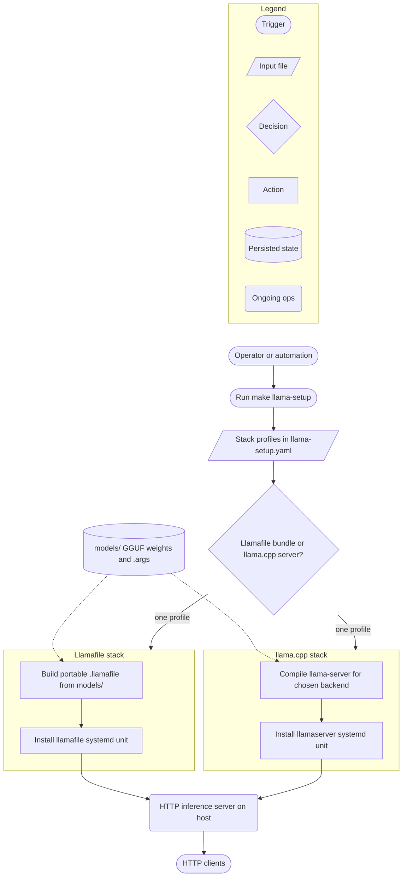
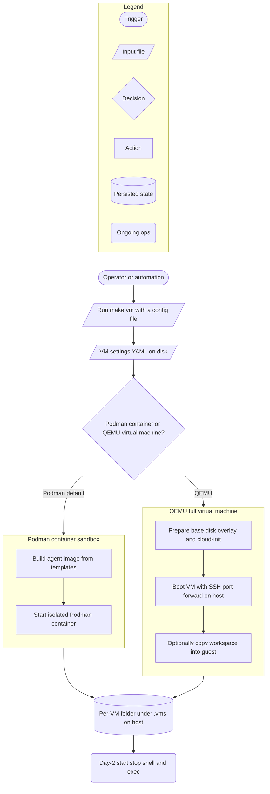

# Sovereign Digital Workspace Stack

A federated repository for developing and running web services and AI agents on infrastructure **you control**.

The design centers on **data sovereignty**, **system immutability**, and **workspace-wide compliance**: agents run inside guarded sandboxes, quality gates apply before code ships, and sensitive services stay on your machines rather than a vendor cloud.

Clone the repository and run `make install` to set up the core developer toolchain (uv, OpenCode, Podman, Ansible, and the rest of the bootstrap catalog). For GPU-backed LLM inference, QEMU agent VMs, or a host VPN tunnel, use the matching installer listed under **Getting Started** below. Section 2 covers each subsystem; section 5 covers the contribution contract and quality gates.

---

## 1. Getting Started

### Prerequisites

Before cloning or running workspace installers, confirm your host can support the components you plan to use:

- **Operating system:** Linux (x86_64) or macOS (Apple Silicon or Intel). Most GPU and llama workflows are Linux-first; macOS is supported for general bootstrap and development.
- **Elevated permissions:** `sudo` for system packages (apt/brew), Intel GPU drivers, QEMU firmware, logrotate limits, and optional `git-guard` installation. LLM/GPU prereqs are handled through `make llama-setup`, not the general bootstrap.
- **Boot directory:** `.boot-linux/` on Linux or `.boot-macos/` on macOS. Created and populated when you run `make install` or `make core`; holds vendored binaries (OpenVPN, QEMU pins, and similar) used by CLI extensions. Layout: [`docs/SPEC-BOOT-LAYOUT.md`](docs/SPEC-BOOT-LAYOUT.md).

Install base system packages once per host (before or alongside your first workspace installer). `make install`, `make install-ci`, and `make llama-setup` all run `init-check` automatically; run the steps below manually only when you want to resolve apt/brew gaps ahead of time:

```bash
make init-check    # report missing apt/brew packages
sudo make init     # install from config/system-deps.yaml
```

### Installation paths

Choose the installer that matches what you are setting up. Each path has its own interactive TUI, CI-friendly non-interactive variant, and linked documentation.

- **General development tools** (`uv`, OpenCode, Podman, Ansible, and the rest of the bootstrap catalog):  
  `make install` (interactive TUI). Component list: [`workspace/config/bootstrap-components.yaml`](workspace/config/bootstrap-components.yaml)

- **CI / unattended bootstrap** (same components, fixed defaults):  
  `make install-ci`. Config: [`workspace/config/install-defaults.yaml`](workspace/config/install-defaults.yaml)

- **LLM inference, Intel GPU, Vulkan, llamafile / llama.cpp** (builds, bundles, systemd deploy, diagnostics):  
  `make llama-setup`. Operator guide: [`docs/SPEC-LLAMA-SETUP-TUI.md`](docs/SPEC-LLAMA-SETUP-TUI.md).  
  Llama, GPU drivers, and `xpu-smi` are **not** part of `make install`; use this path instead.

- **LLM setup in CI** (non-interactive defaults, no TTY):  
  `make llama-setup-ci`. Defaults: [`workspace/config/llama-setup-defaults.yaml`](workspace/config/llama-setup-defaults.yaml)

- **QEMU hypervisor** (binaries, firmware, cloud-image helpers for `make vm`):  
  `make install-qemu`. Spec: [`docs/SPEC-VM-HYPERVISOR.md`](docs/SPEC-VM-HYPERVISOR.md)

- **Host OpenVPN client** (tunnel to remote workspace networks):  
  `make vpn-install`. Spec: [`docs/SPEC-OPENVPN.md`](docs/SPEC-OPENVPN.md)

### Quick start (general bootstrap)

```bash
git clone git@github.com:Independent-AI-Labs/WORKSPACE-VM.git && cd WORKSPACE-VM

make install
```

The bootstrap TUI installs selected components from the federated dependency graph. When finished, `ami-oc` (opencode wrapper) is on your PATH.

### Post-install (requires sudo)

```bash
make enforce-syslog-limits
```

Applies logrotate and journald rate limits on `/var/log/syslog` so runaway logging cannot fill the root disk.

Optional operator steps:

```bash
sudo make guard-up         # idempotent fleet bring-up (provision + guard install)
sudo make guard-refresh    # after pulling guard code
make guard-check           # read-only health
```

---

## 2. Subsystems

### LLM inference (llamafile / llama.cpp)

Recommended entrypoint:

```bash
make llama-setup
```

[`workspace/config/llama-setup.yaml`](workspace/config/llama-setup.yaml) defines stack profiles. `make llama-setup` reads one profile, builds that stack, and leaves a single HTTP inference server on the host. Weights live in `models/` (GGUF + `.args`). The `llamafile_cpu_chat` profile skips systemd deploy and runs as a local binary (see table).



The wizard runs **one** profile per invocation; the other stack is not built or deployed.

Bundle zipalign detail: [`docs/SPEC-LLAMAFILE-MINICPM5-1B.md`](docs/SPEC-LLAMAFILE-MINICPM5-1B.md).

Stack profiles:

| ID | Deploy unit | Port |
| :--- | :--- | :--- |
| `llamafile_vulkan_server` | `llamafile-<model>` | 8765 |
| `llama_cpp_vulkan` | `llamaserver@vulkan` | 8080 |
| `llama_cpp_sycl` | `llamaserver@sycl` | 8082 |
| `llama_cpp_cpu` | `llamaserver@cpu` | 8081 |
| `llamafile_cpu_chat` | none (local binary) | n/a |

Escape hatches (scripting / CI):

```bash
make -f Makefile.llamafile help
make -f Makefile.llamaserver help
```

Specs: [`docs/SPEC-LLAMA-SETUP-TUI.md`](docs/SPEC-LLAMA-SETUP-TUI.md), [`docs/SPEC-LLAMAFILE-MINICPM5-1B.md`](docs/SPEC-LLAMAFILE-MINICPM5-1B.md)

### Agent VMs (`make vm`)

One settings file picks the isolation backend; both paths leave a per-VM folder on the host that day-2 commands reuse.



`rebuild` and file sync are Podman-only today. Module map: [`docs/SPEC-VM-HYPERVISOR.md#1-architecture`](docs/SPEC-VM-HYPERVISOR.md#1-architecture).

**QEMU provision** ([`qemu_provision.py`](workspace/cli/hypervisor/qemu_provision.py)): host tree is virtio-9p **read-only** at `/mnt/workspace-ro`; profile selects what rsyncs to `/opt/workspace` before guest `make install-ci`. Host tree is never written by the guest.

| `provision` | Rsync scope |
| :--- | :--- |
| `poc` | Workspace core layout only |
| `guard` | Skeleton + `projects/CI/` + `projects/WORKSPACE-GUARD/` |
| `full-ci` | Skeleton + entire `projects/` |

**Podman network** ([`vm_build.py`](workspace/cli/vm_build.py)): default `network.mode: none` (`--network none`). `NET_ADMIN` is added only for bridge + `internet`/`proxy` policy, or OpenVPN with `vpn_type: container`. QEMU POC defers most network modes.

**Guard E2E:** authoritative capability tests run inside a provisioned QEMU guest (`make test-e2e-qemu-full`, `make test-authoritative`). See [`docs/SPEC-VM-HYPERVISOR.md` section 12](docs/SPEC-VM-HYPERVISOR.md#12-workspace-guard-integration).

```bash
make install-qemu          # once per host (QEMU + genisoimage + cloud-localds)
make vm CONFIG=path/to/vm.yaml
make vm-list
make test-e2e-qemu         # guard E2E in QEMU guest
```

Specs: [`docs/REQ-VM-HYPERVISOR.md`](docs/REQ-VM-HYPERVISOR.md), [`docs/SPEC-VM-HYPERVISOR.md`](docs/SPEC-VM-HYPERVISOR.md), [`docs/TRACK-VM-HYPERVISOR.md`](docs/TRACK-VM-HYPERVISOR.md)

### Host VPN

Architecture: [`docs/SPEC-OPENVPN.md#architecture`](docs/SPEC-OPENVPN.md#architecture).

```bash
make vpn-install
make vpn-start             # PERSIST=1 for reboot auto-start
make vpn-status
```

Spec: [`docs/SPEC-OPENVPN.md`](docs/SPEC-OPENVPN.md)

### Benchmarks

Llamafile transcript classifier: replays OpenCode SQLite sessions turn-by-turn against a running llamafile server, using a rolling 32K context window with pinned `id_slot` and `cache_prompt`. Requires server up first (`make llama-setup` or `make -f Makefile.llamafile install-llamafile`).

```bash
make -f Makefile.llamafile benchmark-llamafile-transcript-classifier
```

README: [`benchmarks/llamafile/transcript_classifier/README.md`](benchmarks/llamafile/transcript_classifier/README.md)

---

## 3. Workspace Philosophy

Multiple independent git repos live under `projects/` ([`workspace/config/workspace-clones.yaml`](workspace/config/workspace-clones.yaml)). `projects/CI` and `projects/DATAOPS` are mandatory; others opt in via `bootstrap-repos`.

- **Fail-Closed Security:** Agent VMs default to air-gapped Podman. `git-guard` wraps `/usr/bin/git` (blocks `--no-verify`, history rewrite). `podman-guard` enforces container policy.
- **Compliance as Code:** WORKSPACE-CI (`projects/CI/`) generates native git hooks from `.pre-commit-config.yaml` and installs them recursively across nested repos. Hook stages and checks: [`projects/CI/README.md`](projects/CI/README.md).
- **Topological Orchestration:** Prefer `moon` tasks. Resync clones with `moon run :update`.

Hook stages and checks: [`projects/CI/README.md`](projects/CI/README.md).

---

## 4. Navigation Map

| Purpose | Path | Description |
| :--- | :--- | :--- |
| **Core Agents** | `workspace/` | Agent logic, CLI entrypoints, provider handlers. |
| **Workspace CI** | `projects/CI/` | Enforcement engine, system-deps resolver, native hooks. |
| **Data/Infra** | `projects/DATAOPS/` | Sovereign services (Postgres, Keycloak, Vaultwarden). |
| **Orchestration** | `projects/` | Federated projects (TRADING, SRP, PORTAL, etc.). |
| **LLM models** | `models/` | GGUF weights and `.args` manifests for llamafile bundles. |
| **LLM setup scripts** | `scripts/setup/` | Build, GPU probe, Intel/Vulkan prereqs, Ansible wrappers. |
| **Benchmarks** | `benchmarks/` | Config-driven inference benchmarks. |
| **Workspace docs** | `docs/` | REQ/SPEC/TRACK documents (indexed in [`docs/README.md`](docs/README.md)). |
| **Subsystem specs** | `projects/*/docs/` | Per-project requirements. |

---

## 5. Contribution Contract

Before opening a PR:

1. **Pass the contract:** `make contract-check` (Makefile targets) and `make check` (lint + type-check + test via moon). Run `make check-push` locally to mirror the pre-push gate.
2. **Install hooks:** `make install-hooks` (or `make install`, which runs `install-hooks-recursive` across the workspace and nested `projects/*` repos). Hooks are mandatory; there is no `--no-verify` escape when git-guard is installed.
3. **Understand the gates:** WORKSPACE-CI enforces three hook stages from [`projects/CI/`](projects/CI/):
   - **pre-commit**: ruff format/lint, mypy, gitleaks, banned-word and error-swallow scans, file-length limits, dependency freshness, unstaged-change guard.
   - **commit-msg**: conventional message format (`type: description` + body); blocks agent attribution patterns.
   - **pre-push**: `make check-push`, coverage thresholds, co-authored history scan.
4. **Align history:** No rebase/amend on pushed commits; git-guard enforces this at the syscall boundary.
5. **Documentation:** New specs live under `docs/` or the project's `docs/` subdirectory.

Full doc index: [`docs/README.md`](docs/README.md)
