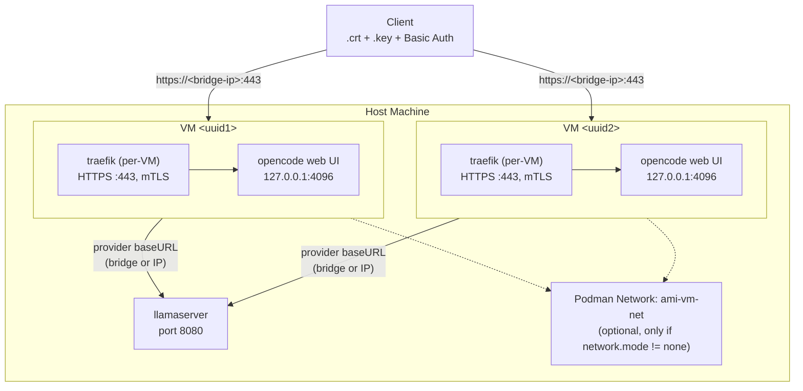

# AMI-AGENTS V3 — Complete Migration Plan

**Document ID:** AMI-MIGRATION-V3-v1.1
**Status:** Active — Phase 1 complete, Phase 2 in progress
**Last Updated:** 2026-06-06
**Author:** AMI-Agents Engineering

> **Current state (2026-06-06):** Phase 1 (code deletions) complete. Phase 2 ~80% done — `oc` wrapper exists, opencode installed, bootstrap_opencode.sh present, shell aliases active, extension manifest updated, agent tests nuked. Remaining Phase 2: Makefile targets (install-opencode/update-opencode), test_setup_shell_aliases.py update. Phase 3 redesigned (multi-VM `make vm` system replacing single docker-compose). Phases 3-6 not started.

---

## Table of Contents

1. [Scope & Context](#1-scope-context)
2. [Archive Strategy](#2-archive-strategy)
3. [Code Deletions](#3-code-deletions)
4. [Replacement Architecture](#4-replacement-architecture)
5. [Docker Virtualisation Stack](#5-docker-virtualisation-stack)
6. [Traefik HTTPS with Client Certificate Authentication](#6-traefik-https-with-client-certificate-authentication)
7. [Ansible Orchestration](#7-ansible-orchestration)
8. [Bootstrapping & Installation](#8-bootstrapping-installation)
9. [Migration Phases](#9-migration-phases)
10. [Verification](#10-verification)
11. [Risk Register](#11-risk-register)
12. [Appendix: File Inventory](#12-appendix-file-inventory)

---

## 1. Scope & Context

### 1.1 What AMI-AGENTS Is Today

AMI-AGENTS is a federated AI-agent workspace with:
- **Python agent orchestration layer** — `ami/` package (CLI entrypoints, provider routing, transcript storage, bootloader agent, TUI components)
- **Three proprietary CLI agents** installed via npm: `@anthropic-ai/claude-code`, `@google/gemini-cli`, `@qwen-code/qwen-code` (in `scripts/package.json`)
- **Custom Python CLI/TUI** — `ami/cli/` (claude_cli.py, gemini_cli.py, qwen_cli.py), `ami/cli_components/` (dialogs, text editor, status, containers), `ami/core/` (bootloader agent, conversation, guards)
- **Existing opencode source clone** at `projects/opencode/` (anomalyco/opencode `dev` branch, full git history)
- **Container specification** (DRAFT) — `docs/specifications/SPEC-AGENT-CONTAINERS.md` plans container isolation
- **Docker infrastructure** — AMI-DATAOPS compose stack (postgres, redis, dgraph, mongo, keycloak, vaultwarden, prometheus, searxng) — no reverse proxy deployed yet (per-VM Traefik planned, see §5)
- **Ansible** — llamaserver deployment playbooks
- **CI/quality** — AMI-CI enforcement, pre-commit hooks, RUST-GUARD git immutability

### 1.2 What Changes

| Component | Current State | Target State |
|-----------|--------------|--------------|
| Agent CLI runtime | Claude Code + Gemini + Qwen (npm) | **opencode-ai only** (npm) |
| Python agent orchestration | `ami/cli/`, `ami/core/`, `ami/cli_components/`, `ami/types/`, `ami/tools/` | **Archived** — all agent orchestration delegated to opencode |
| Agent CLI wrappers | `claude_cli.py`, `gemini_cli.py`, `qwen_cli.py` | **Deleted** |
| CLI version manager | `update_cli_versions.py` | **Deleted** — opencode-ai version managed via npm |
| Agent bootstrap | `bootstrap_agents.sh` (installs 3 CLIs) | **Replaced** — installs `opencode-ai` only |
| Shell extensions | `extension_registry.py`, custom `ami-*` commands | **Replaced** — aliases to `opencode` |
| Docs archive | Active requirements, research, specs for A2A | **Moved** to `docs/archive/v2/` |
| Container spec | DRAFT SPEC-AGENT-CONTAINERS.md | **Superseded** by this plan's Dockerisation |
| Reverse proxy | **None** | **Traefik** with mutual TLS |
| opencode web UI | Not configured | **Enabled** on `127.0.0.1:4096` inside container; proxied by per-VM Traefik on `:443` with mTLS when `network.mode != none` |

### 1.3 What Stays

| Component | Reason |
|-----------|--------|
| `projects/opencode/` | **Source clone** — continues as the development branch for opencode itself |
| `projects/AMI-DATAOPS/` | Data infrastructure (postgres, keycloak, etc.) — independent of agent choice |
| `projects/AMI-CI/` | CI enforcement — independent of agent choice |
| `projects/RUST-GUARD/` | Git immutability — security infrastructure |
| `workspace/config/` | Configuration (automation, bootstrap components, hooks) — still used by Makefile |
| `workspace/scripts/bootstrap/` | System tool bootstrapping (uv, python, rust, podman, moon, etc.) — independent |
| `workspace/scripts/pre-req.sh` | System pre-requisites — still needed |
| `workspace/scripts/shell/` | Shell setup — ported to use `opencode` instead of 3 agents |
| `workspace/types/` | Shared types (LegendRender, ContainerStatusDisplay, etc.) — needed by CLI components |
| `ansible/` | Deployment automation — expanded |
| `Makefile` | Build orchestration — target names mostly stay, implementations change |
| `.pre-commit-config.yaml` | Quality gates — unchanged |
| `pyproject.toml` | Python package — `workspace` package tree stays for CI/config scripts |

---

## 2. Archive Strategy

### 2.1 Archive Location

All pre-V3 material moves to `docs/archive/v2/`:

```
docs/archive/v2/
├── AGENTS.md                    # Old agent rules (replaced by V3 rules)
├── ARCH-AGENT-ECOSYSTEM.md      # Superseded architecture
├── AUDIT-CLAUDE-SESSION-*.md    # Old audits
├── AUDIT-INSTALL-ISSUES.md      # Old audits
├── DEPENDENCY-MAP.md            # Old map
├── EXTENSIONS.md                # Old extension spec
├── GUIDE-USAGE.md               # Old usage guide
├── README.md                    # Old docs readme
├── VULKAN-SWA-PROMPT-PROCESSING-BUG.md  # Old bug report
├── requirements/                # Old requirements (REQ-AGENT-CONTAINERS, REQ-EXTENSIONS, etc.)
├── specifications/              # Old specs (SPEC-AGENT-CONTAINERS, SPEC-EXTENSIONS, etc.)
├── architecture/                # Old architecture proposals
├── research/                    # Research programme (WS-1 through WS-7, EXECUTIVE-SUMMARY)
└── archive/                     # Old archive (previously at docs/archive/)
```

### 2.2 What Moves vs Deletes

| Action | Items |
|--------|-------|
| **Archive** (move to `docs/archive/v2/`) | All doc files in `docs/` except `REQUIREMENTS-A2A.md`, `GAP-ANALYSIS-A2A.md`, and this plan |
| **Delete** | All Python agent orchestration code: `ami/cli/`, `ami/core/`, `ami/tools/` |
| **Keep** | `ami/cli_components/` — status/storage/legend files (ops extension entry points) |
| **Keep** | `ami/types/` — needed by surviving cli_components (LegendRender, ContainerStatusDisplay, etc.) |
| **Delete** | Duplicated `ami/cli_components/text_input_utils.py` — resolved from AMI-DATAOPS via namespace packages |
| **Delete** | `scripts/package.json` (claude, gemini, qwen deps) |
| **Delete** | `scripts/setup/node.sh` |
| **Delete** | `ami/tools/update_cli_versions.py` |
| **Delete** | `ami/scripts/bootstrap/bootstrap_agents.sh` |
| **Rewrite** | `README.md` — point to opencode-ai as primary agent |
| **Rewrite** | `AGENTS.md` — V3 rules (opencode-focused, no claude/gemini/qwen) |

---

## 3. Code Deletions

### 3.1 Python Agent Orchestration (Entirely Replaced by opencode-ai)

The Python agent layer was a full custom agent runtime. Every file below is **deleted** because opencode-ai handles all of this:

```
ami/cli/                           # Custom CLI entrypoints
  ├── base_provider.py             # Provider abstraction
  ├── claude_cli.py                # Claude Code CLI wrapper
  ├── gemini_cli.py                # Gemini CLI wrapper
  ├── qwen_cli.py                  # Qwen CLI wrapper
  ├── factory.py                   # Agent factory
  ├── interface.py                 # Agent interface
  ├── main.py                      # CLI main
  ├── mode_handlers.py             # Mode routing
  ├── process_utils.py             # Process management
  ├── provider_type.py             # Provider types
  ├── streaming.py                 # Output streaming
  ├── streaming_utils.py           # Streaming utilities
  ├── stream_processor.py          # Stream processing
  ├── timer_utils.py               # Timer utilities
  ├── transcript_search.py         # Transcript search
  ├── transcript_store.py          # Transcript storage
  ├── validation_utils.py          # Validation
  ├── editor_utils.py              # Editor utilities
  ├── env_utils.py                 # Environment utilities
  ├── exec_utils.py                # Execution utilities
  ├── exceptions.py                # Exceptions
  ├── config.py                    # CLI config
  ├── constants.py                 # Constants
  └── __init__.py

ami/core/                          # Agent core
  ├── bootloader_agent.py          # Bootloader agent
  ├── config.py                    # Core config
  ├── constants.py                 # Constants
  ├── conversation.py              # Conversation management
  ├── env.py                       # Environment
  ├── factory.py                   # Agent factory
  ├── guards.py                    # Safety guards
  ├── interfaces.py                # Interfaces
  ├── logic.py                     # Agent logic
  ├── models.py                    # Data models
  ├── utils.py                     # Utilities
  ├── policies/                    # Policy enforcers
  └── __init__.py

ami/cli_components/                # PARTIALLY DELETED — see below
                                   # Files moved to AMI-DATAOPS: dialogs, format_utils, keys,
                                   # menu_selector, selection_dialog, selection_dialog_render,
                                   # selector, tui, terminal/ansi, text_input_utils
                                   # Files KEPT (ops extension entry points): status, storage,
                                   # legend, status_containers, status_systemd, status_utils
                                   # Details: docs/MIGRATION-CLI-COMPONENTS-TO-DATAOPS.md §4.2

ami/types/                         # KEPT — surviving cli_components need types
                                   # (LegendRender, ContainerStatusDisplay, ContainerInspectInfo,
                                   # ComposeInfo, ContainerSizeData, ContainerStatsData, etc.)
                                   # that the slim DATAOPS consolidated results.py does not provide.
                                   # Details: docs/MIGRATION-CLI-COMPONENTS-TO-DATAOPS.md §5.4

ami/tools/                         # Agent tools (deleted: replaced by opencode tools)
  ├── update_cli_versions.py       # CLI version updater
  ├── test_qwen_silence.py         # Qwen test utility
  └── clean_temp_files.py          # Temp file cleanup
```

### 3.2 Agent CLI Bootstrap (Replaced by opencode-ai)

```
scripts/
  ├── package.json                 # @anthropic-ai/claude-code, @google/gemini-cli, @qwen-code/qwen-code
  ├── package.json.backup          # Same
  └── setup/node.sh                # Node agent installer

ami/scripts/bootstrap/bootstrap_agents.sh   # Agent bootstrap script
```

**Replacement:** `workspace/scripts/bootstrap/bootstrap_opencode.sh` — single-file installer that runs `npm install -g opencode-ai@latest`. No local `package.json` needed — opencode is a single npm package.

**Makefile migration:**

```
install-node-agents   → DELETED  → replace by install-opencode + update-opencode
update-node-agents    → DELETED  → replace by update-opencode
```

New targets (planned, not yet implemented):

```makefile
.PHONY: install-opencode
install-opencode: ## Install opencode-ai globally via npm
	@echo "📦 Installing opencode-ai..."
	@bash workspace/scripts/bootstrap/bootstrap_opencode.sh

.PHONY: update-opencode
update-opencode: ## Update opencode-ai to latest
	@npm update -g opencode-ai
	@echo "✅ opencode-ai updated"
```

`install-opencode` is to be added to the `make install` dependency chain — placed after `core` so Node.js is bootstrapped, and before `register-extensions` so the `oc` wrapper works on first use.

**Current state:** opencode is installed via bootstrap; Makefile targets not yet created (Phase 2 items 2.3-2.5 pending).

### 3.3 Documentation

All files moved to `docs/archive/v2/` (see §2.1).

---

## 4. Replacement Architecture

### 4.1 opencode-ai as Single Agent CLI

The npm package `opencode-ai` (v1.15.13+) becomes the sole agent CLI.

**Installation:**
```bash
npm install -g opencode-ai
# Provides: opencode CLI binary
```

**opencode.json** (host config — used by the `oc` wrapper on the host
machine. This is separate from the per-VM generated `opencode.json` which
has no models baked in. The host config includes models for direct CLI use):
```json
{
  "$schema": "https://opencode.ai/config.json",
  "provider": {
    "llama.cpp": {
      "npm": "@ai-sdk/openai-compatible",
      "name": "llama-server (agent VM)",
      "options": {
        "baseURL": "http://llamaserver:8080/v1"
      },
      "models": {
        "Qwen3.6-35B-A3B-UD-Q4_K_M.gguf": {
          "name": "Qwen3.6-35B-A3B (256K context)",
          "limit": {
            "context": 262144,
            "output": 65536
          }
        }
      }
    },
    "openai-compatible": {
      "npm": "@ai-sdk/openai-compatible",
      "name": "External providers",
      "options": {
        "baseURL": "http://gateway:8080/a2a/v1"
      }
    }
  },
  "server": {
    "port": 4096,
    "hostname": "127.0.0.1"
  }
}
```

### 4.2 Shell Integration

**`~/.bashrc` addition:**
```bash
# AMI-Agents V3 — opencode-ai as primary agent CLI
export PATH="$HOME/.ami/bin:$PATH"
alias @="oc"
alias msg="oc"
```

**`oc` wrapper** (`workspace/scripts/bin/oc`): Prints the AMI welcome banner (system paths, tool versions, extension status) fresh on each invocation as environment context, writes it to `~/.config/opencode/ami-environment.md` for the agent to pick up, copies config template from `workspace/config/opencode/`, then delegates to `npx opencode`.

```bash
#!/usr/bin/env bash
set -e
SCRIPT_DIR="$(cd "$(dirname "$(readlink -f "${BASH_SOURCE[0]}")")" && pwd)"
AMI_ROOT="$SCRIPT_DIR"
while [[ "$AMI_ROOT" != "/" && ! -f "$AMI_ROOT/pyproject.toml" ]]; do
    AMI_ROOT="$(dirname "$AMI_ROOT")"
done
ORIG_PWD="$PWD"
export AMI_ROOT && cd "$AMI_ROOT"
BOOT_DIR="${BOOT_LINUX_DIR:-${AMI_ROOT}/.boot-linux}"
NPX="${BOOT_DIR}/bin/npx"

WELCOME=$("$AMI_ROOT/workspace/scripts/bin/welcome" --plain 2>/dev/null || echo "AMI-AGENTS workspace")
printf '%b\n' "$WELCOME" && echo ""
printf '%b\n' "$WELCOME" > "${HOME}/.config/opencode/ami-environment.md"
OC_SRC="$AMI_ROOT/workspace/config/opencode"
OC_DIR="${HOME}/.config/opencode"
mkdir -p "$OC_DIR/plugins"
[ ! -f "$OC_DIR/opencode.jsonc" ] && cp "$OC_SRC/opencode.jsonc" "$OC_DIR/opencode.jsonc"
[ ! -f "$OC_DIR/plugins/ami-context.ts" ] && cp "$OC_SRC/plugins/ami-context.ts" "$OC_DIR/plugins/ami-context.ts"
export OPENCODE_ENABLE_EXA=1
if [[ $# -gt 0 ]]; then
    exec "$NPX" opencode run --dir "$ORIG_PWD" "$*"
else
    exec "$NPX" opencode "$ORIG_PWD"
fi
```

Full details in `docs/MIGRATION-CLI-COMPONENTS-TO-DATAOPS.md` §14.

### 4.3 Makefile Changes

| Target | Change |
|--------|--------|
| `install-node-agents` | **Deleted** — replaced by `install-opencode` |
| `update-node-agents` | **Deleted** — replaced by `update-opencode` |
| `install-opencode` | **New** — `npm install -g opencode-ai` via `bootstrap_opencode.sh`, added to `make install` chain |
| `update-opencode` | **New** — `npm update -g opencode-ai` |
| `install` | Add `$(MAKE) install-opencode` dependency after `core`, before `register-extensions` |
| `install-hooks` | **Unchanged** — AMI-CI hooks are agent-agnostic |
| `sync` | **Unchanged** — uv sync for Python CI tools |
| `test` | **Unchanged** — pytest for Python CI tests |
| `help` | Add opencode-ai targets |

### 4.4 Dev Shell

The `opencode` terminal UI runs inside the agent VM container (see §5). For host-side management, the `oc` wrapper prints the welcome banner as context and delegates to `opencode`.

---

## 5. Docker Virtualisation Stack

### 5.1 Architecture



Each VM is a Podman container built from a config file (see Phase 3).
**By default VMs have no network** (`network.mode: none`). When network
is enabled (`mode: bridge`), the VM joins a named Podman bridge network
and runs its own Traefik reverse proxy (systemd service inside the
container) terminating mTLS on port 443, forwarding to opencode web on
`127.0.0.1:4096`. No shared proxy — each VM is self-contained.

The host adds `<uuid>.vm.local → <bridge-ip>` to `/etc/hosts` so
clients can reach the VM by hostname. The llamaserver runs on the host
(or a dedicated container) and VMs connect to it over the bridge
network or via host IP.

### 5.2 VM Build Pipeline

The Dockerfile layers the host's build system inside the container
using `ubuntu:22.04` as base, systemd as PID 1, and opencode web
as a systemd service. See §3.3 for the full multi-stage Dockerfile,
§3.1 for the VM config schema, and §3.8 for the step-by-step
`make vm` build process.

### 5.3 Traefik (Per-VM, Inside Container)

Each VM runs its own Traefik as a systemd service. Traefik is
bootstrapped via `bootstrap_traefik.sh` (a new component in
`bootstrap-components.yaml`). Include `traefik` in the VM config's
`components:` list to make it available.

The generated Traefik static config is minimal — one entrypoint, one
backend:

```yaml
# /etc/traefik/traefik.yml (inside container)
entryPoints:
  websecure:
    address: ":443"
providers:
  file:
    filename: /etc/traefik/dynamic.yml
```

The dynamic config routes everything to opencode:

```yaml
# /etc/traefik/dynamic.yml (inside container)
tls:
  options:
    default:
      minVersion: VersionTLS13
      clientAuth:
        clientAuthType: RequireAndVerifyClientCert
        caFiles:
          - /etc/ssl/ami/ca.crt
  certificates:
    - certFile: /etc/ssl/ami/server.crt
      keyFile: /etc/ssl/ami/server.key
http:
  routers:
    opencode:
      rule: "PathPrefix(`/`)"
      entryPoints: ["websecure"]
      service: opencode
      tls: {}
  services:
    opencode:
      loadBalancer:
        servers:
          - url: "http://127.0.0.1:4096"
```

Systemd unit (`traefik.service`):

```ini
[Unit]
Description=Traefik reverse proxy
After=network.target ami-network.service opencode.service

[Service]
Type=simple
User=ami
ExecStart=/opt/ami-agents/.boot-linux/bin/traefik --configfile=/etc/traefik/traefik.yml
Restart=on-failure
RestartSec=5
StandardOutput=journal
StandardError=journal

[Install]
WantedBy=multi-user.target
```

The `opencode.service` unit gets `Before=traefik.service` added.
Traefik's port 443 is exposed to the Podman network; the host routes
to it via `/etc/hosts` entry (see §3.8 step 17).

`traefik.service` is only generated when `network.mode != none` AND
`web_ui: true`. If the VM has no network, there's no point running a
reverse proxy.

### 5.4 Certificate Generation

Per-VM certificates live at `.vms/<uuid>/certs/`. The `make vm cert
<id>` command generates:

| File | Purpose |
|------|---------|
| `ca.crt` / `ca.key` | Per-VM CA (4096-bit RSA, SHA-512, 3650 days) |
| `server.crt` / `server.key` | Traefik server cert (CN=`<uuid>.vm.local`) |
| `client.crt` / `client.key` | Client cert for browser import (CN=ami-admin) |

Client certs are the "diagonal" — only someone holding the client key
can establish an mTLS connection to that VM. Keys are gitignored; certs
are generated per-VM and also gitignored (they contain per-UUID hostnames
and are not reusable across deployments). The `make vm cert <id>` command
prints the client cert for out-of-band distribution.

### 5.5 Integration with AMI-DATAOPS Stack

The existing AMI-DATAOPS `docker-compose.yml` remains independent. VMs
with `network.mode: bridge` on the same named Podman network can reach
DATAOPS services (postgres, keycloak, etc.) at their host ports.

---

## 6. Traefik HTTPS with Client Certificate Authentication

### 6.1 Requirements

| Requirement | Detail |
|-------------|--------|
| T-1 | Each VM runs its own Traefik instance as a systemd service |
| T-2 | Traefik MUST terminate TLS 1.3 with per-VM server certificate |
| T-3 | Client certificate authentication MUST be required (mTLS) |
| T-4 | Only clients with a valid client certificate MAY connect |
| T-5 | Traefik SHALL NOT accept plain HTTP on port 443 |
| T-6 | opencode web UI SHALL bind to 127.0.0.1:4096 (not exposed outside container) |
| T-7 | Client certificates SHALL be distributed out-of-band (never committed to repo) |
| T-8 | Traefik is NOT started when network.mode is none |

### 6.2 Access Flow

```
Client with <uuid>.crt + <uuid>.key + Basic Auth password
       │
       │ https://<bridge-ip>:443  (or https://<uuid>.vm.local if /etc/hosts updated)
       ▼
VM's Traefik (:443, inside container)
       │
       │ TLS 1.3 handshake → client cert verified against VM's CA
       │
       ▼ Traefik → http://127.0.0.1:4096 (inside container)
       │
       ▼
opencode web UI → Basic Auth challenge (OPENCODE_SERVER_PASSWORD)
```

---

## 7. Ansible Orchestration

### 7.1 New Playbooks

| Playbook | Purpose |
|----------|---------|
| `site.yml` | Top-level playbook — orchestrates full stack deployment |
| `opencode.yml` | Deploy/update opencode-ai globally |
| `vm-host.yml` | Provision VM host (podman, bootstrap tools, cert infrastructure) |
| `llamaserver.yml` | Existing — unchanged, manage LLM backend |

Traefik no longer has a dedicated playbook — it runs inside each VM
as a systemd service, bootstrapped via `make install-ci` like any
other component.

### 7.2 `site.yml`

```yaml
---
- name: AMI-Agents V3 — Full Stack Deployment
  hosts: localhost
  gather_facts: true

  vars:
    opencode_version: "latest"

  tasks:
    - name: Include opencode role
      ansible.builtin.include_role:
        name: opencode
    - name: Include vm-host role
      ansible.builtin.include_role:
        name: vm-host
    - name: Include llamaserver role
      ansible.builtin.include_role:
        name: llamaserver
```

### 7.3 Ansible Role: `opencode`

**`ansible/roles/opencode/tasks/main.yml`:**
```yaml
---
- name: Install opencode-ai globally
  npm:
    name: opencode-ai
    state: latest
    global: true
  become: true

- name: Ensure opencode config directory exists
  file:
    path: "{{ ansible_env.HOME }}/.config/opencode"
    state: directory
    mode: "0700"

- name: Deploy opencode.json
  template:
    src: opencode.json.j2
    dest: "{{ ansible_env.HOME }}/.config/opencode/config.json"
    mode: "0600"

- name: Verify opencode installation
  command: opencode --version
  register: opencode_version_result
  changed_when: false
  failed_when: opencode_version_result.rc != 0
```

---

## 8. Bootstrapping & Installation

### 8.1 New Installation Flow

```
1. git clone AMI-AGENTS
2. sudo make init          — system deps (apt packages)
3. make core               — bootstrap uv, python, node, podman, etc.
4. make install-ci         — install all components from install-defaults.yaml
5. make vm <config.yaml>   — build + start an agent VM
```

### 8.2 `make install` Targets (Updated)

**Dependency chain for `make install`:**
```
init-check → sync-package → build-guard → bootstrap_installer.py → register-extensions → shell-setup
```

| Target | Action |
|--------|--------|
| `core` | Bootstrap uv, python, node, git-xet, moon, podman (prerequisite for install-ci) |
| `install-ci` | Non-interactive: `bootstrap_installer.py --defaults install-defaults.yaml` |
| `install` | Interactive: `bootstrap_installer.py` (TUI component selection) |
| `install-shell` | Register `oc` alias + extensions in `~/.bashrc` |
| `install-hooks` | Pre-commit hooks (unchanged from V2) |
| `register-extensions` | Symlink all extension commands to `.boot-linux/bin/` |
| `install-opencode` | (planned) Explicit npm install of opencode-ai |
| `update-opencode` | (planned) `npm update -g opencode-ai` |
| `vm <config>` | Build + start a VM (see §3.8) |
| `vm-*` | VM lifecycle subcommands (see §3.9) |

### 8.3 Certificate Generation

Certificates are generated per-VM by `make vm cert <id>` (see §3.8 step 11).
Each VM gets its own CA + server cert + client cert under
`.vms/<uuid>/certs/`. No shared certificate infrastructure — each VM is
an independent security domain.

---

## 9. Migration Phases

### Phase 1: Documentation & Preparation (Days 1-2)

| Action | Detail |
|--------|--------|
| 1.1 | Archive all V2 docs to `docs/archive/v2/` |
| 1.2 | Delete Python agent orchestration code (§3.1): `workspace/cli/`, `workspace/core/`, `workspace/tools/`, duplicated `workspace/cli_components/text_input_utils.py`. Keep status/storage/legend (ops extensions) and `workspace/types/` (surviving cli_components dependency chain). |
| 1.3 | Delete agent CLI scripts (§3.2) |
| 1.4 | Write new `AGENTS.md` and `README.md` |
| 1.5 | **EXECUTED 2026-06-01** — Code deletions complete: `ami/cli/` ✓, `ami/core/` ✓, `ami/tools/` ✓, `ami-agent` ✓, `scripts/package.json` ✓, moved 11 cli_components files to AMI-DATAOPS ✓. `ami/cli_components/` (status/storage/legend) and `ami/types/` intentionally KEPT (ops extensions). |

**Artifacts:** Updated docs, cleaned repo. Agent orchestration code (`ami/cli/`, `ami/core/`, `ami/tools/`) deleted. 11 cli_components files moved to AMI-DATAOPS (imported via namespace packages). Remaining cli_components files (status, storage, legend, status_*) stay for `ops` extension entry points.

### Phase 2: Base opencode Integration (Days 3-4) — ~80% DONE

| Action | Detail | Status |
|--------|--------|--------|
| 2.1 | `npx opencode` available (v1.15.13 installed at `~/.local/npm-global/bin/opencode`) | **DONE** ✓ |
| 2.2 | Draft `opencode.docker.json` with llama.cpp + web UI config | **DONE** ✓ |
| 2.3 | **Replace** `install-node-agents` + `update-node-agents` with `install-opencode` + `update-opencode` in Makefile | **NOT DONE** |
| 2.4 | **Create** `workspace/scripts/bootstrap/bootstrap_opencode.sh` — `npm install -g opencode-ai@latest` | **DONE** ✓ (exists at workspace/scripts/bootstrap/bootstrap_opencode.sh; installs via hermetic npm) |
| 2.5 | **Add** `$(MAKE) install-opencode` to `make install` dependency chain (after `core`, before `register-extensions`) | **NOT DONE** |
| 2.6 | **NUKE** `ami-agent` and `ami-transcripts` — replaced by single `oc` wrapper | **DONE** ✓ |
| 2.7 | **NUKE** `scripts/package.json`, `scripts/package.json.backup`, `workspace/scripts/bootstrap/bootstrap_agents.sh` | **DONE** ✓ |
| 2.8 | **CREATE** `workspace/scripts/bin/oc` — prints `welcome` banner fresh as agent context, delegates to `npx opencode` | **DONE** ✓ (`oc` not `ami-oc`; see §4.2) |
| 2.9 | Update `shell-setup`: `@` and `msg` aliases → `oc` | **DONE** ✓ (aliases at shell-setup lines 216-217) |
| 2.10 | Update `extension.manifest.yaml`: register `oc` as core extension | **DONE** ✓ (line 2-13 of workspace/scripts/bin/extension.manifest.yaml) |
| 2.11 | **NUKE** agent test files (27 files — see §12.1) | **DONE** ✓ |
| 2.12 | Update `test_setup_shell_aliases.py`: replace agent aliases with `oc` | **NOT DONE** |
| 2.13 | Verify opencode CLI + `oc` work in dev shell | **DONE** ✓ |

**The only surviving agent wrapper:** `oc` — prints the AMI welcome banner (system paths, tool versions, extension status) fresh on each invocation as environment context, copies config template from `workspace/config/opencode/`, then delegates to `npx opencode`.

**Full command mapping and migration sequence:** `docs/MIGRATION-CLI-COMPONENTS-TO-DATAOPS.md` §14.

### Phase 3: Containerisation — `make vm` (Days 5-8) — NOT STARTED

Per-VM agent containers managed via `make vm` subcommands. Each VM is
an isolated Podman container built by layering the host's `make init` +
`make install-ci` flow inside a Dockerfile, then routing its opencode
web UI through a per-VM Traefik reverse proxy (systemd service inside each VM).

#### 3.1 VM Config File

Each VM is defined by a YAML config file. The `make vm` command reads it
and generates a per-VM Dockerfile, systemd unit, and Traefik route.
Analogous to how `make install-ci` reads `install-defaults.yaml` —
the `components:` key uses the **same format** and is passed directly
to `make install-ci` inside the container.

**`workspace/config/vm-template.yaml`** (canonical reference):

```yaml
# VM configuration — passed to `make vm <config.yaml>`
# Only `components` is required. Everything else has defaults.

# --- Install layer ---
# Same format as install-defaults.yaml. Passed to make install-ci.
components:
  - uv
  - python
  - node
  - opencode
  # ... any component from bootstrap-components.yaml

extra_apt:                     # system packages beyond what make init covers
  - "htop"
  - "vim"

# --- Resources ---
resources:
  memory: "4g"
  cpus: 2
  pids_limit: 256

# --- Provider ---
# Baked into the container's generated opencode.json so the web UI
# and CLI can discover the provider. Models are NOT baked in — the
# caller supplies model at connection time (via web UI or --model flag).
provider:
  name: llama.cpp              # provider key in opencode.json
  options:
    base_url: "http://llamaserver:8080/v1"

# --- Credentials ---
# How API keys get into the container.
credentials:
  mode: none                   # none | clone | api (default: none)
  # none  — container has no keys. User configures after connecting.
  # clone — copy host ~/.config/opencode/ into container at build time.
  #         Development convenience. Gives container access to host keys.
  # api   — future: provision from OpenBAO vault or user API at
  #         connection time. Keys never touch the host filesystem.

# --- SSH & Host Configs ---
# SSH keys and host dotfiles provisioned at build time into /home/ami/.
ssh:
  mode: none                    # none | inherit | custom (default: none)
  # none    — no SSH keys or host configs. Container starts blank.
  # inherit — copy ~/.ssh/ and common host dotfiles from host into image.
  #           Copied files: ~/.ssh/id_*, ~/.ssh/config, ~/.ssh/known_hosts,
  #           ~/.gitconfig, ~/.aws/*, ~/.npmrc.
  # custom  — user provides explicit file list. Each file copied from
  #           host path into the container image at /home/ami/.
  #   files:
  #     - "~/.ssh/id_ed25519"
  #     - "~/.gitconfig"
  #     - "/path/to/custom-ssh-config:/home/ami/.ssh/config"

# --- Filesystem ---
files:                         # pre-copied into /workspace volume before first start
  - src: "workspace/"
    dst: "/workspace/"
  - src: "workspace/config/"
    dst: "/workspace/config/"

sync:                          # directory-based file sync, user-invoked via make vm sync
  - dir: "workspace/"
    strategy: merge            # merge | overwrite | skip
    exclude:
      - ".git"
      - "__pycache__"
      - "*.pyc"
  - dir: "workspace/config/"
    strategy: overwrite

mounts:                        # read-only bind mounts (absolute paths; ${HOME} expanded)
  - "${HOME}/.ssh:/home/ami/.ssh:ro"

# --- Network ---
# DEFAULT: none — container has zero network interfaces (fully air-gapped).
# User opts in to each connectivity tier.
network:
  mode: none                    # none | bridge | host | openvpn

  # --- mode: bridge ---
  # Container joins a named Podman bridge network.
  # mode: bridge
  #   network_name: "ami-vm-net"         # podman network (created if missing)
  #   policy: unrestricted                # none | internet | proxy | unrestricted
  #     none         — --internal flag: containers communicate, no external access
  #     internet     — MASQUERADE to internet, iptables blocks host gateway
  #     proxy        — only proxy host reachable, HTTP_PROXY env injected
  #     unrestricted — full access, no iptables blocks
  #   proxy_url: "http://host.containers.internal:3128"  # for policy: proxy
  #   whitelist:                     # extra ACCEPT rules (host:port)
  #     - "llamaserver:8080"
  #     - "1.2.3.4:443"

  # --- mode: host ---
  # --network host. Shares host's network namespace. ZERO isolation.
  # mode: host

  # --- mode: openvpn ---
  # Container traffic routed through OpenVPN tunnel.
  # mode: openvpn
  #   vpn_type: container               # container runs its own OpenVPN
  #   vpn_config: "${HOME}/.ami/vpn/client.ovpn"  # absolute path, copied into image
  #   vpn_type: netns                   # joins existing host netns
  #     vpn_netns: "vpn-ns"             # netns name at /run/netns/<name>

# --- Runtime ---
web_ui: true                   # start opencode web via systemd service (PID 1)
env:                           # env vars injected into container
  OPENCODE_ENABLE_EXA: "1"

# --- Security ---
security:
  purge_sudo: true              # apt purge sudo + rm -rf /etc/sudoers.d/* (default: true)
  no_new_privileges: true       # --security-opt=no-new-privileges (default: true)
  read_only_rootfs: true        # --read-only with tmpfs on /tmp and /run (default: true)
  cap_drop:                     # --cap-drop flags (default: ALL)
    - "ALL"
  cap_add: []                    # auto-derived from network.mode (empty for mode:none)
  # For a debug/dev VM that needs full access:
  # security:
  #   purge_sudo: false
  #   cap_drop: []
  #   cap_add: []
  #   read_only_rootfs: false
```

**Minimal VM config** — everything else gets defaults.
Note: the default `network.mode: none` means this VM has no network
access. To serve the web UI, add `network.mode: bridge`.

```yaml
components:
  - uv
  - python
  - node
  - opencode
provider:
  name: llama.cpp
  options:
    base_url: "http://192.168.50.63:8080/v1"
```

#### 3.2 `make vm` Subcommands

```
make vm <config.yaml>           — build + create + start a VM (idempotent: rebuilds if config changed)
make vm start <id>              — podman start <id> + write PID to .vms/<id>/pid
make vm stop <id>               — podman stop <id> + remove PID file
make vm resume <id>             — alias for start (restores from stopped state)
make vm delete <id> [--purge]   — podman rm + optional volume rm
make vm kill <id>               — read .vms/<id>/pid, send SIGKILL directly (bypasses podman)
make vm shell <id>              — podman exec -it -u ami <id> /bin/bash
make vm exec <id> -- <cmd>      — podman exec <id> <cmd> (one-off, no TTY)
make vm logs <id> [-f]          — podman logs [--follow] <id>
make vm list                    — podman ps -a --filter label=ami.type=vm
make vm status <id>             — podman inspect + podman stats --no-stream
make vm rebuild <id>            — re-run init + install-ci inside container, restart
make vm sync <id>               — file sync per config.sync rules
make vm config <id>             — print the YAML config used to create this VM
make vm cert <id>               — generate/print client cert for mTLS access to this VM
```

IDs are **UUIDv7** strings generated on first build. The config file is
copied into `.vms/<uuid>/vm.yaml` so the mapping is durable.

#### 3.3 Build Pipeline (Inside Dockerfile)

```mermaid
graph TD
    BASE["FROM ubuntu:22.04 AS base<br/>apt install systemd, iptables, ...<br/>useradd ami (temp sudo)"]
    INIT["FROM base AS init<br/>make init → make core<br/>revoke sudo from ami"]
    INSTALL["FROM init AS installer<br/>make ensure-repos<br/>make sync-package<br/>make install-ci"]
    RUNTIME["FROM installer AS runtime<br/>ARG OPENCODE_SERVER_PASSWORD<br/>ARG AGENT_UID<br/>── if purge_sudo: apt purge sudo<br/>── generate opencode.json<br/>── if ssh.mode == inherit: COPY ~/.ssh/ ~/.gitconfig ~/.aws/<br/>── if ssh.mode == custom: COPY explicit files<br/>── if credentials.mode == clone: COPY ~/.config/opencode/<br/>── COPY certs/ → /etc/ssl/ami/<br/>── generate systemd units<br/>── HEALTHCHECK curl :4096<br/>── ENTRYPOINT /sbin/init"]
    BASE --> INIT
    INIT --> INSTALL
    INSTALL --> RUNTIME

The generated `opencode.json` inside the container:

```jsonc
{
  "provider": {
    "<name>": {
      "npm": "@ai-sdk/openai-compatible",
      "options": {
        "baseURL": "<base_url>"
      }
    }
  },
  "server": {
    "port": 4096,
    "hostname": "127.0.0.1"
  }
}
```

No model is baked in. Models are selected by the caller at connection
time (web UI model picker, or `opencode run --model <provider/model>`).

**SSH & host configs** (copied at build time into `/home/ami/`):

| `ssh.mode` | Files copied | Source |
|------------|-------------|--------|
| `none` (default) | Nothing | — |
| `inherit` | `~/.ssh/id_*`, `~/.ssh/config`, `~/.ssh/known_hosts`, `~/.gitconfig`, `~/.aws/*`, `~/.npmrc` | Host user's home |
| `custom` | User-specified list (`ssh.files:`) | Per-file host paths |

For `inherit` mode, only files that exist on the host are copied —
missing files are silently skipped. File permissions are preserved.
The container's `/home/ami/.ssh/` directory gets mode `0700`, private
key files get `0600`.

`custom` mode file format:

```yaml
ssh:
  mode: custom
  files:
    - "~/.ssh/id_ed25519"                      # → /home/ami/.ssh/id_ed25519
    - "~/.gitconfig"                            # → /home/ami/.gitconfig
    - "/host/path/config:~/.ssh/config"         # src:dst override
```

**Credentials provisioning** (copied at build time):

| `credentials.mode` | Effect |
|-------------------|--------|
| `none` (default) | Container has no API keys. User configures after connecting. |
| `clone` | Copy host `~/.config/opencode/` → `/home/ami/.config/opencode/` |
| `api` | Future: provision from OpenBAO vault or user API at connection time. |

All credential copies are baked into the image at build time and
gitignored (Dockerfile references paths outside the build context).

**Systemd services** (generated conditionally based on config):

| Service | When generated | Purpose |
|---------|---------------|---------|
| `opencode.service` | Always (if `web_ui: true`) | opencode web on `127.0.0.1:4096` |
| `traefik.service` | `network.mode != none` AND `web_ui: true` | mTLS proxy `:443 → :4096` |
| `ami-network.service` | `network.mode: bridge` + `network.policy: internet\|proxy` | iptables rules |
| `openvpn.service` | `network.mode: openvpn` + `vpn_type: container` | OpenVPN client |

`opencode.service`:

```ini
[Unit]
Description=opencode web UI
After=network.target ami-network.service
Before=traefik.service

[Service]
Type=simple
User=ami
Group=ami
WorkingDirectory=/workspace
Environment=OPENCODE_ENABLE_EXA=1
Environment=OPENCODE_SERVER_PASSWORD=<generated password>
ExecStart=/opt/ami-agents/.boot-linux/bin/opencode web --port 4096
Restart=on-failure
RestartSec=5
StandardOutput=journal
StandardError=journal

[Install]
WantedBy=multi-user.target
```

`ami-network.service` (only for `bridge: internet` or `bridge: proxy`):

```ini
[Unit]
Description=AMI VM network isolation
Before=opencode.service

[Service]
Type=oneshot
RemainAfterExit=yes
Environment=AMI_NETWORK_POLICY=<policy>
Environment=AMI_PROXY_URL=<proxy_url if policy=proxy>
EnvironmentFile=/etc/ami/network-whitelist
ExecStart=/usr/local/sbin/ami-network-setup
```

`ami-network-setup` applies mode-specific iptables rules (see §3.7).

The build requires `--privileged` during the init stage (apt + iptables).
At runtime, security flags are driven by `config.security` (see §3.1).
`cap_add` is auto-derived from `network.mode` (see §3.7), user overrides
in `security.cap_add` take precedence.

#### 3.4 Per-VM Directory Structure

```
.vms/
├── .gitkeep
├── <uuid>/
│   ├── vm.yaml              # copy of the config used to create this VM
│   ├── password             # random 32-char password for OPENCODE_SERVER_PASSWORD
│   ├── pid                  # host PID of running container (written by make vm start)
│   ├── Dockerfile           # generated, per-VM, gitignored
│   ├── .dockerignore        # generated
│   └── certs/
│       ├── ca.crt           # CA certificate
│       ├── server.crt       # Traefik server cert (CN=<uuid>.vm.local)
│       ├── server.key
│       ├── client.crt       # client cert for this VM
│       └── client.key
```

`.vms/**/Dockerfile`, `.vms/**/.dockerignore`, `.vms/**/password`,
`.vms/**/*.key`, `.vms/**/*.crt`, and `.vms/**/pid` are gitignored.
`.vms/vm.yaml` and `.vms/.gitkeep` are committed. Per-VM certs and
keys are never committed — they are distributed out-of-band.

#### 3.5 Traefik (Per-VM, Inside Container)

Each VM runs its own Traefik systemd service. Traefik is bootstrapped
via `bootstrap_traefik.sh` (new component). Include `traefik` in the
`components:` list. See §5.3 for the static/dynamic config templates
and systemd unit.

Traefik is only generated when `network.mode != none` AND `web_ui: true`.
The `opencode.service` gets `Before=traefik.service` so the reverse
proxy starts after opencode is ready.

#### 3.6 Volumes

Three named volumes per VM, created by `make vm`:

| Volume | Mount point | Purpose |
|--------|-------------|---------|
| `<uuid>-workspace` | `/workspace` | rsynced source files |
| `<uuid>-transcripts` | `/transcripts` | opencode session logs |
| `<uuid>-cache` | `/cache` | `.boot-linux`, `.venv`, `node_modules` |

Host bind mounts:
- Each entry in `config.mounts` is passed as `--mount type=bind,src=<host-path>,dst=<container-path>,ro`

`make vm delete --purge` removes all three volumes.

#### 3.7 Network Isolation

Network isolation is driven by `config.network.mode` and
`config.network.policy`. At runtime, `ami-network-setup` (called by
`ami-network.service`, only generated when needed) applies iptables
rules. `NET_ADMIN` capability is auto-derived from the mode:

| Mode + Policy | cap_add | iptables? | Systemd service |
|---|---|---|---|
| `none` | `[]` | No | None needed |
| `bridge: none` | `[]` | No (`--internal`) | None |
| `bridge: internet` | `["NET_ADMIN"]` | Yes | `ami-network.service` |
| `bridge: proxy` | `["NET_ADMIN"]` | Yes | `ami-network.service` |
| `bridge: unrestricted` | `[]` | No | None |
| `host` | `[]` | No (host stack) | None |
| `openvpn: container` | `["NET_ADMIN"]` | VPN manages | `openvpn.service` |
| `openvpn: netns` | `[]` | Inherits NS | None |

User overrides in `security.cap_add` take precedence.

**Iptables rules per policy:**

_Policy `internet`:_

```bash
# Allow DNS to bridge gateway (aardvark-dns)
iptables -A FORWARD -s $CONTAINER_IP -d $GATEWAY -p udp --dport 53 -j ACCEPT
iptables -A FORWARD -s $CONTAINER_IP -d $GATEWAY -p tcp --dport 53 -j ACCEPT
# Block all other host access
iptables -A FORWARD -s $CONTAINER_IP -d $GATEWAY -j DROP
# Internet flows through MASQUERADE normally
# whitelist entries become ACCEPT rules before the DROP
```

_Policy `proxy`:_

```bash
# Allow ONLY the proxy host
iptables -I NETAVARK_FORWARD 1 -s $CONTAINER_IP -d $PROXY_IP -p tcp --dport $PROXY_PORT -j ACCEPT
iptables -A FORWARD -s $CONTAINER_IP -j DROP
# HTTP_PROXY/HTTPS_PROXY env vars injected into container
```

**OpenVPN (mode: `openvpn`):**

For `vpn_type: container`, the container needs `--device /dev/net/tun` +
`NET_ADMIN`. The `openvpn.service` unit starts the VPN client at boot,
routing all container traffic through the tunnel. The VPN config file
is copied into the image at build time.

For `vpn_type: netns`, the container joins an existing host network
namespace via `--network ns:/run/netns/<name>`. The namespace must
already have the VPN tunnel configured. No additional iptables or
capabilities needed — the container inherits the existing setup.

#### 3.8 Build Process (What `make vm <config.yaml>` Does)

```
1.  Validate config against schema
2.  Generate UUIDv7
3.  Generate 32-char random password → .vms/<uuid>/password (gitignored)
4.  mkdir -p .vms/<uuid>/ .vms/<uuid>/certs/
5.  Copy config → .vms/<uuid>/vm.yaml
6.  Generate .vms/<uuid>/Dockerfile from Jinja2 template using config values
7.  Generate .vms/<uuid>/.dockerignore
8.  If network.mode == bridge:
      Create podman network <network_name> if it doesn't exist
9.  podman build -t ami-vm:<uuid> \
       --build-arg AGENT_UID=$(id -u) \
       --build-arg OPENCODE_SERVER_PASSWORD=$(cat .vms/<uuid>/password) \
       -f .vms/<uuid>/Dockerfile .
10. podman volume create <uuid>-workspace <uuid>-transcripts <uuid>-cache
11. Pre-copy files: for each entry in config.files, cp src → volume mountpoint
12. Generate certs: CA + server + client → .vms/<uuid>/certs/
13. Determine podman run flags from config:
      --network <derived from network.mode>
      $(for cap in config.security.cap_drop; echo "--cap-drop=$cap")
      $(for cap in cap_add; echo "--cap-add=$cap")  # auto-derived or user override
      $(security.no_new_privileges && echo "--security-opt=no-new-privileges")
      $(security.read_only_rootfs && echo "--read-only --tmpfs /tmp:rw,... --tmpfs /run:rw,...")
      -e AMI_NETWORK_MODE=<mode> -e AMI_NETWORK_POLICY=<policy>
      -e AMI_NETWORK_WHITELIST="<entries>"
      -e AMI_PROXY_URL=<proxy_url if policy=proxy>
      $(if openvpn:container then --device /dev/net/tun)
      --env-file=<generated env file from config.env>
14. podman run -d --name <uuid> \
       --label ami.type=vm --label ami.uuid=<uuid> \
       --label ami.config=<sha256> \
       -v <uuid>-workspace:/workspace \
       -v <uuid>-transcripts:/transcripts \
       -v <uuid>-cache:/cache \
       --mount type=bind,src=<host config mounts>,ro \
       --userns=keep-id \
       --memory=<mem> --cpus=<cpus> --pids-limit=<limit> \
       <network + security flags from step 13> \
       --health-on-failure=stop \
       ami-vm:<uuid>
15. Write host PID: podman inspect -f '{{.State.Pid}}' <uuid> → .vms/<uuid>/pid
16. If bridge mode: get container IP, add to host /etc/hosts:
      <container-ip> <uuid>.vm.local
17. Healthcheck wait: poll until podman inspect reports healthy
18. Print summary:
       VM <uuid> created
         UUID:     <uuid>
         Password: $(cat .vms/<uuid>/password)
         URL:      https://<uuid>.vm.local:443  (if bridge mode)
         Cert:     .vms/<uuid>/certs/client.crt
```

If a VM with the same config SHA256 already exists, `make vm` is
idempotent: it prints the existing UUID instead of rebuilding. Use
`make vm rebuild <id>` to force a rebuild from the stored `vm.yaml`.

#### 3.9 Convenience Makefile Targets

```makefile
# Added to the main Makefile:
.PHONY: vm vm-start vm-stop vm-resume vm-delete vm-shell vm-logs vm-list vm-status vm-rebuild vm-config vm-cert vm-exec vm-kill vm-sync
vm: ## Build + start a VM from config file
	@.venv/bin/python workspace/scripts/vm_manager.py create --config "$(filter-out $@,$(MAKECMDGOALS))"
%::
	@true   # catch-all to prevent Make from treating config paths as targets

vm-start:    ## podman start <id> + write PID to .vms/<id>/pid
	@.venv/bin/python workspace/scripts/vm_manager.py start $(filter-out $@,$(MAKECMDGOALS))
vm-stop:     ## podman stop <id> + remove PID file
	@.venv/bin/python workspace/scripts/vm_manager.py stop $(filter-out $@,$(MAKECMDGOALS))
vm-resume:   ## podman start <id> (alias for start)
	@.venv/bin/python workspace/scripts/vm_manager.py start $(filter-out $@,$(MAKECMDGOALS))
vm-delete:   ## podman rm <id> + optional volume purge
	@.venv/bin/python workspace/scripts/vm_manager.py delete $(filter-out $@,$(MAKECMDGOALS))
vm-kill:     ## read .vms/<id>/pid, send SIGKILL directly, skip podman
	@.venv/bin/python workspace/scripts/vm_manager.py kill $(filter-out $@,$(MAKECMDGOALS))
vm-shell:    ## podman exec -it <id> bash
	@.venv/bin/python workspace/scripts/vm_manager.py shell $(filter-out $@,$(MAKECMDGOALS))
vm-exec:     ## podman exec <id> -- <cmd> (one-off command, no TTY)
	@.venv/bin/python workspace/scripts/vm_manager.py exec $(filter-out $@,$(MAKECMDGOALS))
vm-logs:     ## podman logs <id>
	@.venv/bin/python workspace/scripts/vm_manager.py logs $(filter-out $@,$(MAKECMDGOALS))
vm-list:     ## podman ps -a --filter label=ami.type=vm
	@.venv/bin/python workspace/scripts/vm_manager.py list
vm-status:   ## podman inspect + stats for <id>
	@.venv/bin/python workspace/scripts/vm_manager.py status $(filter-out $@,$(MAKECMDGOALS))
vm-rebuild:  ## re-build + restart <id> from its stored vm.yaml
	@.venv/bin/python workspace/scripts/vm_manager.py rebuild $(filter-out $@,$(MAKECMDGOALS))
vm-config:   ## print the vm.yaml used to create <id>
	@.venv/bin/python workspace/scripts/vm_manager.py config $(filter-out $@,$(MAKECMDGOALS))
vm-cert:     ## generate/print client cert for <id>
	@.venv/bin/python workspace/scripts/vm_manager.py cert $(filter-out $@,$(MAKECMDGOALS))
vm-sync:     ## file sync per config.sync rules
	@.venv/bin/python workspace/scripts/vm_manager.py sync $(filter-out $@,$(MAKECMDGOALS))
```

#### 3.10 Files to Create (Phase 3)

```
workspace/scripts/vm_manager.py                           # Python CLI — all VM subcommands
workspace/config/vm-template.yaml                          # canonical VM config reference + schema
workspace/scripts/templates/Dockerfile.vm.j2              # Jinja2 Dockerfile template
workspace/scripts/templates/systemd-opencode.service.j2    # systemd unit template
workspace/scripts/templates/systemd-ami-network.service.j2 # iptables systemd unit template
workspace/scripts/templates/systemd-traefik.service.j2     # per-VM Traefik service template
workspace/scripts/templates/traefik-static.yml.j2          # per-VM Traefik static config template
workspace/scripts/templates/traefik-dynamic.yml.j2         # per-VM Traefik dynamic config template
workspace/scripts/templates/systemd-openvpn.service.j2     # OpenVPN service template (when mode=openvpn)
res/systemd/ami-network-setup                              # shell script called by ami-network.service
.vms/.gitkeep                                               # gitkeep for .vms/ dir
workspace/scripts/bootstrap/bootstrap_certs.sh             # certificate generation (CA + server + client)
workspace/scripts/bootstrap/bootstrap_traefik.sh           # Traefik bootstrap (new component)
```

#### 3.11 What Was Dropped from Original V3 Plan

The old Phase 3 model (single `docker-compose.yml` with one hardcoded
agent + llamaserver + traefik) is replaced by the multi-VM design above.
Specific changes:

| Old Plan | New Plan |
|----------|----------|
| One fixed agent container | Per-config VM instances with UUIDv7 IDs |
| Single `docker-compose.yml` | Per-VM generated Dockerfile |
| `Dockerfile.agent` at repo root | Jinja2 template at `workspace/scripts/templates/Dockerfile.vm.j2` |
| Hardcoded `opencode.json` | Generated from VM config (provider baseURL only, no model baked in) |
| llamaserver in compose | External — VMs connect over bridge or host IP |
| Shared Traefik proxy | **Per-VM Traefik** systemd service inside each container |
| Shared certs at `docker/traefik/certs/` | Per-VM certs at `.vms/<uuid>/certs/` |
| `ami-agent.local` hostname | `<uuid>.vm.local` via host `/etc/hosts` |
| Default: network on whitelist mode | **Default: `network.mode: none`** (air-gapped) |
| Hand-rolled gosu entrypoint | systemd as PID 1 + conditional services |
| Key provisioning via bind mount | Three modes: clone (host copy), none, api (future OpenBAO) |

#### 3.12 Implementation Architecture — Codebase Mapping

This section maps the VM system design to the actual codebase layout
and documents which existing facilities are reused.

**Existing facilities reused (no new code needed):**

| Facility | Path | Purpose |
|----------|------|---------|
| UUIDv7 generator | `workspace/utils/uuid_utils.py::uuid7()` | VM ID generation (RFC 9562, pure Python) |
| Podman runtime | `.boot-linux/bin/podman` (v5.6.2, rootless, netavark) | Container lifecycle |
| Container types | `workspace/types/status.py` (PodmanContainer, PortMapping) | VM inspection results |
| Bootstrap pattern | `workspace/scripts/bootstrap/bootstrap_*.sh` | Traefik installation script |
| Component registry | `workspace/config/bootstrap-components.yaml` | Register traefik component |
| Extension system | `workspace/scripts/bin/extension.manifest.yaml` | Register `vm` CLI command |
| Shell wrapper pattern | `workspace/scripts/bin/oc`, `ops`, `repo` | Bash wrapper → `make vm` target |

**New files — where they go:**

| File | Location | Pattern followed |
|------|----------|-----------------|
| VM config model | `workspace/types/vm.py` | Pydantic BaseModel (see `workspace/types/config.py`) |
| VM config template | `workspace/config/vm-template.yaml` | YAML reference (see `install-defaults.yaml`) |
| Bootstrap: traefik | `workspace/scripts/bootstrap/bootstrap_traefik.sh` | Shell script (see `bootstrap_opencode.sh`) |
| Bootstrap: certs | `workspace/scripts/bootstrap/bootstrap_certs.sh` | Shell script (see `bootstrap_podman.sh`) |
| Dockerfile template | `workspace/scripts/templates/Dockerfile.vm.j2` | Jinja2 template |
| Systemd templates | `workspace/scripts/templates/systemd-*.j2` | Jinja2 template |
| Iptables setup | `res/systemd/ami-network-setup` | Shell script (existing `res/` dir) |
| VM CLI | `workspace/cli/vm_manager.py` | CLI module (see `workspace/cli/status.py`) |
| VM bash wrapper | `workspace/scripts/bin/vm` | Bash wrapper (see `workspace/scripts/bin/oc`) |
| VM tests | `tests/unit/cli/test_vm_manager.py` | pytest + strict mypy (see existing tests) |
| VM integration | `tests/integration/test_vm_lifecycle.py` | Integration test (see `test_core_utils.py`) |

**New dependency added to pyproject.toml:**

`jinja2==3.1.6` — Jinja2 templating for Dockerfile, systemd units,
and Traefik config generation. Required for Commit 3 (templates).

**Test conventions to follow:**

- `from __future__ import annotations` at top of every module
- Strict typing — all functions have return type annotations
- No mocks on the module under test (unit tests call real code)
- pytest fixtures: `tmp_path`, `monkeypatch`, `capsys`
- Pydantic model tests: `model_validate()` with dicts, `pytest.raises(ValidationError)`
- Integration tests: run against real `.boot-linux/bin/podman`
- All test classes use `class TestXxx:` grouping

### Phase 4: Makefile & Bootstrap Integration (Days 9-10) — NOT STARTED

| Action | Detail |
|--------|--------|
| 4.1 | Add Phase 2 Makefile targets: `install-opencode`, `update-opencode` (explicit npm-based install/update for opencode-ai) |
| 4.2 | Wire `install-opencode` into `make install` dependency chain (after `core`, before `register-extensions`) |
| 4.3 | Add Phase 3 `make vm*` targets to Makefile (see §3.9 for full list) |
| 4.4 | Verify podman is in `install-defaults.yaml` as a default component (already present) |
| 4.5 | Update `test_setup_shell_aliases.py` — replace old agent aliases with `oc` |
| 4.6 | Test full `make install` from clean state, then `make vm <config>` end-to-end |

**Artifacts:** Full installation + VM provisioning works end-to-end.

### Phase 5: Verification & Hardening (Days 11-12)

| Action | Detail |
|--------|--------|
| 5.1 | Verify opencode web UI accessible only via mTLS |
| 5.2 | Verify opencode web UI accessible only through Traefik mTLS proxy (not directly on VM's port 4096 outside the container) |
| 5.3 | Verify container isolation (agent cannot access host filesystem except mounted paths) |
| 5.4 | Verify A2A integration (if applicable) |
| 5.5 | Verify all pre-commit hooks still pass |
| 5.6 | Verify Python CI tests still pass (`make test`) |

**Artifacts:** Signed-off verification report.

### Phase 6: Documentation & Cleanup (Day 13)

| Action | Detail |
|--------|--------|
| 6.1 | Update `docs/README.md` with V3 architecture overview |
| 6.2 | Write ops runbook for VM container management |
| 6.3 | Write certificate renewal procedure |
| 6.4 | Final commit with all changes |

**Artifacts:** Complete V3 documentation.

---

## 10. Verification

### 10.1 Acceptance Criteria

| ID | Criterion | How to Verify |
|----|-----------|---------------|
| AC-1 | `opencode` is the only agent CLI installed | `which claude` → not found; `which opencode` → found |
| AC-2 | No old agent source code in repo | `find workspace -name "*claude*" -o -name "*gemini*" -o -name "*qwen*"` → empty |
| AC-3 | Old docs are archived | `ls docs/archive/v2/` → populated |
| AC-4 | `make vm <config.yaml>` builds and runs a VM container | `podman build` succeeds; `podman ps --filter label=ami.type=vm` shows running VM |
| AC-5 | Default: VM has no network | `podman exec <uuid> ip link` → only `lo` present |
| AC-6 | Bridge mode: VM gets network IP | `podman inspect <uuid>` shows bridge network IP |
| AC-7 | Bridge internet mode: blocks host access | With `network.mode: bridge` + `policy: internet`: `podman exec <uuid> curl <gateway-ip>` → timeout; `curl 1.1.1.1` → OK |
| AC-8 | Web UI accessible via mTLS (bridge mode) | `curl -sfk --cert client.crt --key client.key https://<bridge-ip>:443` → 200 |
| AC-9 | Basic Auth required for web UI | Same curl without Authorization header → 401 |
| AC-10 | `make vm kill <id>` terminates hung container | SIGKILL via PID file; `podman ps` shows container exited |
| AC-11 | `make vm list` shows all VMs with status | Output includes UUID, status, network mode |
| AC-12 | All pre-commit hooks pass | `pre-commit run --all-files` → exit 0 |
| AC-13 | Python CI tests pass | `make test` → exit 0 |

### 10.2 Test Matrix

```
┌──────────────────────────────┬────────────┬──────────────┐
│           Test                │  Phase 2   │   Phase 5    │
├──────────────────────────────┼────────────┼──────────────┤
│ opencode CLI works           │     ✓      │      ✓       │
│ No old agent CLIs remain     │     ✓      │      ✓       │
│ make vm builds container     │     —      │      ✓       │
│ Default: VM has no network   │     —      │      ✓       │
│ Bridge mode: VM gets IP      │     —      │      ✓       │
│ Internet policy: blocks host │     —      │      ✓       │
│ mTLS + Basic Auth access     │     —      │      ✓       │
│ make vm kill works by PID    │     —      │      ✓       │
│ Pre-commit hooks pass        │     ✓      │      ✓       │
│ Python CI tests pass         │     ✓      │      ✓       │
│ Full clean install + vm      │     —      │      ✓       │
└──────────────────────────────┴────────────┴──────────────┘
```

---

## 11. Risk Register

| Risk | Likelihood | Impact | Mitigation |
|------|-----------|--------|------------|
| opencode-ai npm package incompatible with LLM endpoint | Low | High | Test against llamaserver before migration; opencode supports OpenAI-compatible API |
| Traefik misconfiguration or cert expiry | Low | Critical | Each VM has its own Traefik (not shared); cert expiry printed at creation; `make vm cert <id>` regenerates; Traefik restart picks up new cert |
| Loss of functionality from old agent CLIs | Medium | Medium | Audit all `ami-*` commands before deletion; map each to opencode equivalent |
| Container build fails on non-Linux | Low | Low | V3 targets Linux x86_64 only (no change from V2) |
| opencode-ai version drift | Low | Low | Pin major version in bootstrap; test upgrade in CI |
| Client certificate leaked | Low | Critical | `gitignore` all `.vms/**/*.key` and `.vms/**/password`; deployer rotates per-VM CA; `make vm cert` reissues |

---

## 12. Appendix: File Inventory

### 12.1 Files to Delete (47 files)

```
ami/cli/__init__.py
ami/cli/base_provider.py
ami/cli/claude_cli.py
ami/cli/config.py
ami/cli/constants.py
ami/cli/editor_utils.py
ami/cli/env_utils.py
ami/cli/exceptions.py
ami/cli/exec_utils.py
ami/cli/factory.py
ami/cli/gemini_cli.py
ami/cli/interface.py
ami/cli/main.py
ami/cli/mode_handlers.py
ami/cli/process_utils.py
ami/cli/provider_type.py
ami/cli/qwen_cli.py
ami/cli/streaming.py
ami/cli/streaming_utils.py
ami/cli/stream_processor.py
ami/cli/timer_utils.py
ami/cli/transcript_search.py
ami/cli/transcript_store.py
ami/cli/validation_utils.py
ami/cli_components/confirmation_dialog.py
ami/cli_components/cursor_manager.py
ami/cli_components/dialogs.py
ami/cli_components/editor_display.py
ami/cli_components/editor_saving.py
ami/cli_components/format_utils.py
ami/cli_components/keys.py
ami/cli_components/menu_selector.py
ami/cli_components/selection_dialog.py
ami/cli_components/selection_dialog_render.py
ami/cli_components/selector.py
ami/cli_components/session_browser.py
ami/cli_components/session_detail.py
ami/cli_components/stream_renderer.py
ami/cli_components/text_editor.py
ami/cli_components/text_input_cli.py
ami/cli_components/text_input_utils.py      # duplicated — imported from DATAOPS
ami/cli_components/tui.py
ami/cli_components/__init__.py
# ── KEPT in ami/cli_components/ (ops extensions) ──
#   status.py          — ops status entry point
#   storage.py         — ops storage entry point
#   legend.py          — imported by status.py
#   status_containers.py  — imported by status.py
#   status_systemd.py  — imported by status.py
#   status_utils.py    — imported by status*.py
ami/core/__init__.py
ami/core/bootloader_agent.py
ami/core/config.py
ami/core/constants.py
ami/core/conversation.py
ami/core/env.py
ami/core/factory.py
ami/core/guards.py
ami/core/interfaces.py
ami/core/logic.py
ami/core/models.py
ami/core/utils.py
ami/tools/clean_temp_files.py
ami/tools/test_qwen_silence.py
ami/tools/update_cli_versions.py
# ── KEPT: ami/types/ entire directory — needed by surviving cli_components
#   (LegendRender, ContainerStatusDisplay, ContainerInspectInfo, ComposeInfo, etc.)
#   See MIGRATION-CLI-COMPONENTS-TO-DATAOPS.md §5.4
scripts/package.json
scripts/package.json.backup
scripts/setup/node.sh
ami/scripts/bootstrap/bootstrap_agents.sh
ami/scripts/bin/ami-agent                  # nuked — replaced by oc (§4.2)
ami/scripts/bin/ami_transcripts.py          # nuked — replaced by opencode session

# Agent test files (nuked — tested deleted agent code)
tests/unit/test_edge_cases_basic.py
tests/unit/test_ami_agent_edge_cases_part2.py
tests/integration/test_ami_agent_interactive_integration.py
tests/e2e/test_performance.py
tests/unit/cli/test_main.py
tests/unit/cli/test_transcript_store.py
tests/unit/cli/test_transcript_search.py
tests/unit/core/test_conversation.py
tests/unit/test_session_browser.py
tests/unit/test_transcript_search.py
tests/integration/test_bootloader_agent_integration.py
```

**Total: ~47 files deleted** (Phase 1 — agent code dirs deleted; 18 cli_components files deleted, 6 kept for ops extensions; types/ entirely kept)

### 12.2 Files to Create (20 files)

```
# Phase 2 — Bootstrap
workspace/scripts/bootstrap/bootstrap_opencode.sh                    # EXISTS ✓ (not via migration plan, pre-existing)

# Phase 3 — VM system
workspace/scripts/vm_manager.py                                     # NOT YET CREATED — Python CLI for all vm subcommands
workspace/config/vm-template.yaml                                    # NOT YET CREATED — canonical VM config + schema
workspace/scripts/templates/Dockerfile.vm.j2                        # NOT YET CREATED — Jinja2 Dockerfile template
workspace/scripts/templates/systemd-opencode.service.j2              # NOT YET CREATED — systemd unit template
workspace/scripts/templates/systemd-ami-network.service.j2           # NOT YET CREATED — iptables systemd unit template
workspace/scripts/templates/systemd-traefik.service.j2               # NOT YET CREATED — Traefik systemd unit template
workspace/scripts/templates/systemd-openvpn.service.j2               # NOT YET CREATED — OpenVPN service template
workspace/scripts/templates/traefik-static.yml.j2                    # NOT YET CREATED — Traefik static config template
workspace/scripts/templates/traefik-dynamic.yml.j2                   # NOT YET CREATED — Traefik dynamic config template
res/systemd/ami-network-setup                                       # NOT YET CREATED — iptables setup shell script
.vms/.gitkeep                                                        # NOT YET CREATED
workspace/scripts/bootstrap/bootstrap_certs.sh                      # NOT YET CREATED — CA + server + client cert generation
workspace/scripts/bootstrap/bootstrap_traefik.sh                    # NOT YET CREATED — Traefik bootstrap component

# Phase 4 — Ansible
ansible/roles/opencode/tasks/main.yml                                # NOT YET CREATED
ansible/roles/opencode/templates/opencode.json.j2                    # NOT YET CREATED
ansible/roles/vm-host/tasks/main.yml                                 # NOT YET CREATED

# Already created (pre-migration, not tracked by this plan):
workspace/scripts/bin/oc                                             # CREATED ✓ (opencode wrapper with welcome context)

# Docs
docs/archive/v2/.gitkeep                                             # NOT YET CREATED
```

### 12.3 Files to Modify (14 files)

```
Makefile                            — install-opencode/update-opencode + vm* targets
README.md                           — V3 architecture                                         # DONE ✓
AGENTS.md                           — V3 rules (opencode focus)                               # DONE ✓
opencode.template.json              — web UI config                                           # NOT VERIFIED
workspace/scripts/shell/shell-setup — opencode aliases (oc, @, msg)                           # DONE ✓
workspace/scripts/bin/extension.manifest.yaml — oc replaces ami-agent/ami-transcripts         # DONE ✓
workspace/config/install-defaults.yaml — already includes podman + opencode (+ traefik if added)  # DONE ✓ (pre-existing)
workspace/scripts/register_extensions.py — opencode extensions                                # NOT YET MODIFIED
.gitignore                          — Add .vms/**/Dockerfile .vms/**/password .vms/**/*.key .vms/**/*.crt  # NOT YET MODIFIED
docs/README.md                      — V3 index                                                # DONE ✓
opencode.json                       — Production config (deployer-specific)                   # DONE ✓
opencode.docker.json                — Docker-specific opencode config (llamaserver + gateway)  # DONE ✓
tests/integration/test_setup_shell_aliases.py — verify oc alias                               # NOT YET MODIFIED
```

---

*End of Migration Plan*
