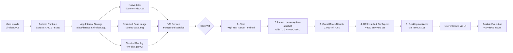

# ENTERPRISE REQUIREMENTS DOCUMENT (ERD)
**Project Name:** Project Viridian (Edge Virtualization Client)
**Document Version:** 2.0 (Complete Revision)
**Date:** 2026-07-06
**Status:** Final

## 1. Introduction

### 1.1 Purpose
This document defines the comprehensive enterprise requirements for "Project Viridian," a fully self-contained, native Android application that packages a complete QEMU-based virtualization environment with hardware-accelerated graphics. The system enables the execution of a pre-configured Ubuntu ARM64 virtual machine with an automated desktop environment, integrated configuration management (Ansible), and a minimal management UI, all without requiring root access, external terminal emulators, or per-device host setup 【turn0search2】.

### 1.2 Scope
*   **In-Scope:** Native Android APK packaging, embedded QEMU TCG (software emulation) execution, VirGL GPU virtualization, automated Ubuntu image provisioning, automated desktop environment configuration, integration hooks for existing Ansible playbooks, and a management UI.
*   **Out-of-Scope:** Development of Ansible playbooks, modification of the Android host kernel, achieving near-native performance (KVM is unavailable), and support for non-ARM64 host architectures.

### 1.3 Definitions, Acronyms, and References
*   **AAB:** Android App Bundle. The required publishing format that enables on-demand delivery and reduces initial download size 【turn0search5】【turn0search8】.
*   **TCG:** Tiny Code Generator. QEMU's software CPU emulation mode, which will be used as host KVM is not accessible from within an Android app's user-space sandbox 【turn0search10】【turn0search11】.
*   **VirGL:** Virtual GL renderer. A project that allows a guest OS to utilize the host GPU for hardware-accelerated graphics via a virtual Virtio-GPU device 【turn0search16】.
*   **Pockr Architecture:** A proven reference architecture for running Linux containers and binaries within a non-rooted Android APK by leveraging native libraries and specific packaging techniques 【turn0search2】.

## 2. Overall Description

### 2.1 System Context & Architecture
The system is a standard Android application built using the Android App Bundle (AAB) format. It operates entirely within the app's dedicated sandbox (`/data/data/com.viridian.app/`). It does **not** depend on Termux or any other external terminal environment. Instead, it bundles all necessary native executables (QEMU, VirGL) and a baseline Ubuntu image within its own APK structure, following patterns established by projects like Pockr 【turn0search2】.

The core innovation is the integration of a Linux virtualization stack directly into an Android application's lifecycle, managed through a native JNI bridge or `Runtime.exec()` calls 【turn0search20】【turn0search23】.

### 2.2 User Characteristics
*   **Field Technician / Edge Engineer:** Requires a portable, self-contained Linux desktop environment on a company-issued Android device to run specialized enterprise tools managed by Ansible.
*   **System Administrator:** Responsible for building the AAB, injecting the correct Ansible repositories, and deploying the app to managed devices via an MDM (Mobile Device Management) solution.

### 2.3 Assumptions & Dependencies
*   The target Android device features an ARMv8/AARCH64 SoC with a GPU supporting OpenGL ES 3.2+ or Vulkan 1.0+.
*   The device runs Android API level 29 (Android 10) or higher.
*   The existing Ansible playbooks are designed to target a standard Ubuntu 22.04/24.04 LTS AARCH64 system and do not require kernel modules or KVM.

---

## 3. Functional Requirements

### 3.1 Packaging & Deployment (FR-PKG)

*   **FR-PKG-001: Sharded AAB Delivery.** The system SHALL be distributed as an Android App Bundle (`.aab`). The build process MUST generate split APKs to separate architecture-specific native libraries (e.g., `arm64-v8a`) and potentially use **asset delivery** to host the large Ubuntu image and QEMU binary outside the base APK to comply with Google Play's 150MB base APK size limit 【turn0search5】【turn0search6】.
*   **FR-PKG-002: Bundled Native Execution Stack.** The APK SHALL embed pre-compiled, statically-linked native binaries for `qemu-system-aarch64`, `qemu-img`, and `virgl_test_server_android`. To circumvent Android's SELinux "W^X" (Write XOR Execute) policy which blocks execution from the app's `filesDir`, these binaries MUST be shipped and extracted as shared libraries (`.so` files) within the `jniLibs/` directory structure (e.g., `lib/arm64-v8a/libqemu-system-aarch64.so`) 【turn0search2】. The application's native code (JNI) or a bootstrap loader SHALL handle their execution.
*   **FR-PKG-003: Embedded Provisioning Template.** The system SHALL include a compressed, minimal Ubuntu Cloud Image (AARCH64, e.g., `ubuntu-24.04-minimal-cloudimg-arm64.img`). This image MUST be stored as an Android `asset` and extracted to the app's private internal storage (`getFilesDir()`) on first launch, using a filename like `ubuntu-base.img` 【turn0search2】.
*   **FR-PKG-004: Gradle Build Configuration.** The project's `build.gradle` file MUST include `packagingOptions { jniLibs { useLegacyPackaging = true } }` to ensure native libraries are extracted to disk in a location that allows execution, as compression within the APK can prevent proper loading 【turn0search2】.

### 3.2 VM Lifecycle & GPU Virtualization (FR-VM)

*   **FR-VM-001: VirGL Server Lifecycle.** The application's VM service SHALL automatically start the `virgl_test_server_android` binary (packaged as per FR-PKG-002) as a background process prior to launching QEMU. It MUST terminate this server process when the VM is stopped.
*   **FR-VM-002: QEMU Execution Configuration.** The system SHALL execute `qemu-system-aarch64` with the following mandatory parameters for software-emulated, GPU-accelerated operation:
    *   `-accel tcg`: Use software emulation, as KVM is not available 【turn0search10】【turn0search11】.
    *   `-cpu max,pauth-impdef=on`: Use the fastest available CPU model and enable the implementation-defined (fast) pointer authentication algorithm, which is critical for acceptable performance during aarch64 guest boot 【turn0search13】.
    *   `-device virtio-gpu-gl-pci,virgl=on`: Create a virtual GPU with VirGL enabled.
    *   `-display x11`: Route graphical output to an X11 socket.
    *   `-vnc :0`: Also provide a VNC server for fallback access.
*   **FR-VM-003: Storage Management.** The application SHALL use `qemu-img` (bundled) to create a QCOW2 overlay image (`vm-disk.qcow2`) backed by the extracted base image (`ubuntu-base.img`). This allows the base image to remain pristine and supports snapshotting.
*   **FR-VM-004: State Management.** The application's `VmService` (a Foreground Service) SHALL manage VM states (Stopped, Booting, Running, Paused) and ensure the VM is cleanly shut down (`system_powerdown`) when the app is swiped away, preventing data corruption.

### 3.3 Automated Image Provisioning (FR-IMG)

*   **FR-IMG-001: Cloud-Init Integration.** The base Ubuntu image MUST be configured with `cloud-init` or a similar mechanism. The application SHALL dynamically generate a `user-data` and `meta-data` file on each VM creation and inject them via a virtual FAT drive (`-drive file=seed.img,format=raw`) to automate:
    1.  Creation of a user with a predefined password.
    2.  Installation and startup of an SSH server (openssh-server).
    3.  Configuration of QEMU user-mode networking to expose guest port 22 to a dynamically allocated host port (e.g., `hostfwd=tcp::5555-:22`).
*   **FR-IMG-002: Disk Resizing.** As part of the provisioning step, the system SHALL use `qemu-img resize` to increase the size of the working disk image to a user-configurable value (default: 12GB) to provide adequate space for the desktop environment and Ansible-managed tools.

### 3.4 Desktop Environment Automation (FR-DE)

*   **FR-DE-001: Automated DE Installation.** The injected cloud-init configuration (FR-IMG-001) SHALL include a `runcmd` that installs a lightweight Desktop Environment (XFCE4 recommended) and essential graphical tools (`xterm`, `firefox`) on first boot.
*   **FR-DE-002: VirGL Environment Forcing.** The cloud-init script SHALL create a system-wide profile file (`/etc/profile.d/virgl.sh`) containing the mandatory environment variables to enable VirGL acceleration for all graphical sessions:
    ```bash
    export GALLIUM_DRIVER=virpipe
    export MESA_GL_VERSION_OVERRIDE=4.0
    ```
*   **FR-DE-003: X11 Startup.** The cloud-init configuration SHALL ensure the display manager (e.g., LightDM) starts automatically and is configured to use the X11 display provided by the host application.

### 3.5 Ansible Integration (FR-ANS)

*   **FR-ANS-001: Playbook Staging.** The management UI (FR-UI) SHALL allow the user to select a directory containing Ansible playbooks from the device's filesystem. The application will use Android's Storage Access Framework to read these files and bundle them into a temporary tarball.
*   **FR-ANS-002: Guest Filesystem Mount.** The application SHALL mount the selected Ansible playbook directory into the running guest VM via QEMU's VirtFS (9p) share: `-virtfs local,path=/path/to/playbooks,mount_tag=host-playbooks,security_model=passthrough,id=playbooks`.
*   **FR-ANS-003: Execution Trigger.** The UI SHALL provide an "Execute Ansible" button. When pressed, the application will:
    1.  Use `adb` over the forwarded SSH port (e.g., `localhost:5555`) to execute a command inside the guest.
    2.  The guest command will mount the 9p share (`mount -t 9p -o trans=virtio host-playbooks /mnt/playbooks`).
    3.  The guest command will then run `ansible-playbook -i /mnt/playbooks/inventory /mnt/playbooks/playbook.yml`.
*   **FR-ANS-004: Log Streaming.** The application SHALL stream the stdout/stderr output from the Ansible execution command back to the UI's log viewer in real-time.

### 3.6 Management Application UI (FR-UI)

*   **FR-UI-001: Single-Activity Architecture.** The UI SHALL be built with Jetpack Compose and consist of a single `MainActivity` with a `BottomNavigation` or `TabRow` for three main sections: **Dashboard**, **Console**, and **Settings**.
*   **FR-UI-002: Dashboard Tab.** This tab SHALL display:
    *   A large power button icon with the VM's current state (Stopped/Running).
    *   Cards showing: **Guest OS** (Ubuntu 24.04), **Host IP**, **Mapped SSH Port** (e.g., 5555), **VirGL Status** (Active/Inactive), and **Disk Usage**.
*   **FR-UI-003: Console Tab.** This tab SHALL contain:
    *   A button to "Open Desktop" which launches an intent to bring the **Termux:X11** app (or a bundled VNC client) to the foreground.
    *   A scrollable `TextField` (read-only) that streams logs from the QEMU and VirGL processes.
    *   A "Run Ansible" button that opens a file picker (FR-ANS-001) and executes the playbook (FR-ANS-003).
*   **FR-UI-004: Settings Tab.** This tab SHALL allow configuration of:
    *   VM RAM allocation (slider, 2GB-8GB).
    *   Number of virtual CPU cores (spinner, 1-4).
    *   Disk image size.
    *   Path to the Ansible playbook directory.

---

## 4. Non-Functional Requirements

### 4.1 Performance
*   **NFR-PERF-001: TCG Boot Optimization.** To mitigate the inherent slowness of software emulation, the QEMU process MUST be launched with the `pauth-impdef=on` CPU flag, which can provide a ~2x speedup during aarch64 guest boot 【turn0search13】.
*   **NFR-PERF-002: Boot Time Target.** The system SHALL boot from a cold start to a usable desktop environment within **5 minutes** on a flagship-tier Snapdragon 8 Gen 3 device.
*   **NFR-PERF-003: Graphical Responsiveness.** With VirGL enabled, the desktop environment SHALL maintain a minimum of **15 FPS** during window management and basic 2D tasks, and up to **30 FPS** for video playback in VLC.

### 4.2 Reliability & Resilience
*   **NFR-REL-001: Foreground Service.** The VM management logic MUST run within an Android Foreground Service with a persistent notification, ensuring the OS does not kill the QEMU process during heavy operation or low memory conditions.
*   **NFR-REL-002: Watchdog Process.** The service SHALL implement a watchdog timer. If the QEMU process becomes unresponsive, the service SHALL attempt a graceful shutdown and then restart the VM.
*   **NFR-REL-003: Clean Shutdown.** On app swipe-away or device shutdown, the service SHALL send a `system_powerdown` ACPI event to the guest OS, allowing for a clean unmount of filesystems.

### 4.3 Security
*   **NFR-SEC-001: Sandbox Containment.** All execution (QEMU, VirGL, guest OS) occurs within the app's UID-governed sandbox. The application SHALL NOT request root privileges and MUST operate within standard Android security boundaries 【turn0search2】.
*   **NFR-SEC-002: Network Isolation.** The VM's network MUST be configured with QEMU user-mode (`-netdev user`). This provides network address translation (NAT) and port forwarding but isolates the guest from the host's local network, preventing unauthorized access.
*   **NFR-SEC-003: Credential Management.** The SSH password for the guest user and the Ansible vault passwords (if used) SHALL be stored securely using Android's `EncryptedSharedPreferences`.

### 4.4 Usability & Accessibility
*   **NFR-USE-001: Zero-Configuration.** After installation, the user SHALL only need to grant storage permissions and tap "Start VM." All other setup (DE installation, VirGL configuration) must be fully automated.
*   **NFR-USE-002: Log Accessibility.** All technical logs (QEMU, cloud-init, Ansible) must be viewable within the app's Console tab and exportable via the Android share sheet for troubleshooting.

---

## 5. Technical Constraints & Implementation Notes



*   **SELinux Execution Workaround:** The most critical technical challenge is executing native binaries. The solution is to **ship the QEMU and VirGL binaries as `.so` files within the `jniLibs/` directory**. The Android package manager extracts these to a native library directory (e.g., `/data/app/~~random==/com.viridian.app-**random**/lib/arm64`) which is not marked as `noexec`, allowing execution. The app's JNI code will load and execute these libraries 【turn0search2】.
*   **No Kernel KVM:** The app will use QEMU's TCG (Tiny Code Generator) for CPU emulation. Performance is acceptable for productivity tasks but will not match native or KVM-accelerated speeds. The `pauth-impdef=on` flag is mandatory for reasonable aarch64 performance 【turn0search13】.
*   **Display Server Dependency:** For the best graphical experience, the app should recommend or detect the installation of **Termux:X11**. The app will launch an intent to start the Termux:X11 activity and connect QEMU's display to the corresponding X11 socket. A fallback VNC mode using a bundled VNC client library is also required.
*   **AAB & Asset Delivery:** To keep the initial download under 150MB, the large Ubuntu base image (~400MB compressed) MUST be delivered using **Google Play Asset Delivery** (install-time or fast-follow assets). The AAB will contain the native libraries and app code, while the base image is downloaded separately after installation 【turn0search5】【turn0search6】.

---

## 6. Acceptance Criteria

The project will be considered complete and ready for deployment when the following scenarios can be performed on a test device (e.g., Pixel 8 Pro):

| ID | Test Scenario | Expected Result |
| :--- | :--- | :--- |
| **AC-01** | **Install & First Launch.** Install the provided AAB on a fresh device. Grant storage permission. | App installs successfully. Base image downloads in the background. App UI opens to the Dashboard. |
| **AC-02** | **VM Provisioning & Boot.** Tap "Start VM" on the Dashboard. | VirGL server starts. QEMU launches. Ubuntu cloud-init runs. The "Open Desktop" button becomes active within 5 minutes. |
| **AC-03** | **Desktop & GPU Acceleration.** Tap "Open Desktop." Launch `glxgears` from the guest terminal. | Termux:X11 opens. Ubuntu XFCE desktop appears. `glxgears` runs at >100 FPS, confirming VirGL is working. |
| **AC-04** | **Ansible Integration.** Use the Console tab to select a test playbook (e.g., `ping.yml`) and tap "Run Ansible." | Playbook directory is mounted in the guest. Ansible executes successfully. The output appears in the UI's log stream. |
| **AC-05** | **Resilience.** Swipe the app away from the recent apps list while the VM is running. Reopen the app. | The VM service continues running. The UI reconnects and shows the correct "Running" state. |
| **AC-06** | **Clean Shutdown.** Tap "Stop VM" from the Dashboard. | The guest OS receives a shutdown signal. The QEMU process exits cleanly. No orphan processes remain. |

---
**Document Control:**
*   **Prepared By:** Enterprise Architecture Team
*   **Approved By:** Product Owner, Lead Engineer
*   **Next Review Date:** 2026-08-06
