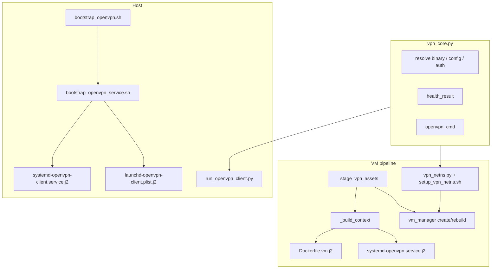

# Specification: OpenVPN Client Automation

**Document ID:** WS-SPEC-OPENVPN-v1.0
**Status:** Draft
**Date:** 2026-07-11
**Classification:** Internal - Enterprise
**Requirements:** [REQ-OPENVPN](REQ-OPENVPN.md)
**References:**
- [REQ-OPENVPN](REQ-OPENVPN.md)
- [REQ-BOOT-LAYOUT](REQ-BOOT-LAYOUT.md)
- [workspace/cli/vpn_core.py](../workspace/cli/vpn_core.py)
- [workspace/types/vm.py](../workspace/types/vm.py)

---

## Overview

Workspace OpenVPN automation spans three layers that share `workspace/cli/vpn_core.py`:

1. **Bootstrap**, install CLI binary into boot directory
2. **Host service**, persistent client on macOS (LaunchAgent) and Linux (systemd user)
3. **VM pipeline**, `network.mode: openvpn` for container-internal or Linux netns attach

OpenVPN Connect (`org.openvpn.client`, `org.openvpn.helper`) is **not integrated**. Health checks scope process detection to the boot-dir binary path.

---

## Architecture



---

## 1. File Inventory

### Create

| Path | Purpose |
|------|---------|
| `workspace/cli/vpn_core.py` | Shared resolution, validation, health |
| `workspace/cli/vpn_netns.py` | Linux netns ensure (Python, testable) |
| `workspace/scripts/bootstrap/bootstrap_openvpn_service.sh` | Render + install host service unit |
| `workspace/scripts/bin/setup_vpn_netns.sh` | `ip netns` + daemon start inside NS |
| `workspace/scripts/templates/systemd-openvpn-client.service.j2` | Linux host user unit |
| `workspace/scripts/templates/launchd-openvpn-client.plist.j2` | macOS LaunchAgent |
| `workspace/config/vpn/.gitkeep` | Placeholder for gitignored config dir |
| `ansible/vpn-client.yml` | Optional Linux playbook wrapper |
| `ansible/roles/vpn-client/tasks/main.yml` | Delegates to bootstrap service script |

### Edit

| Path | Change |
|------|--------|
| `workspace/scripts/bootstrap/bootstrap_openvpn.sh` | Call service install script at end |
| `workspace/scripts/bin/run_openvpn_client.py` | Full action surface via `vpn_core` |
| `workspace/scripts/templates/systemd-openvpn.service.j2` | `container_install_root`, ordering, auth |
| `workspace/scripts/templates/Dockerfile.vm.j2` | Conditional COPY + `mkdir /etc/openvpn` |
| `workspace/cli/vm_build.py` | `_stage_vpn_assets`, context keys |
| `workspace/cli/vm_manager.py` | Stage + netns preflight hooks |
| `workspace/types/vm.py` | `vpn_auth`, auto-component, Darwin netns guard |
| `ansible/inventory/host_vars/localhost.yml` | `local_services.workspace-openvpn` |
| `workspace/scripts/bin/infra/extension.manifest.yaml` | Extended action list |
| `.gitignore` | `workspace/config/vpn/` |
| `workspace/config/vm-template.yaml` | OpenVPN example block |
| `docs/MIGRATION-PLAN.md` | Cross-ref + path corrections |

### Delete

| Path | Reason |
|------|--------|
| `workspace/scripts/ami/scripts/bin/run_openvpn_client.py` | Duplicate superseded by workspace CLI |

---

## 2. Bootstrap (`bootstrap_openvpn.sh`)

Existing behavior preserved: Homebrew on Darwin, apt on Linux, symlink to `<boot-dir>/bin/openvpn`.

**Add** final step:

```bash
source "${SCRIPT_DIR}/bootstrap_openvpn_service.sh" || exit 1
install_openvpn_service "${PROJECT_ROOT}" "${BIN_DIR}/openvpn"
```

`install_openvpn_service` renders templates with Python/Jinja (same loader as `vm_core._render_template`) or a small inline Python one-liner via workspace venv, **must not** add a second template engine.

Service install is **skipped with WARN** when canonical config does not exist (FR-3.3).

---

## 3. Shared Core (`vpn_core.py`)

### Constants

```python
VPN_CONFIG_REL = Path("workspace/config/vpn/client.ovpn")
VPN_AUTH_REL = Path("workspace/config/vpn/auth.txt")
OPENVPN_CONFIG_ENV = "OPENVPN_CONFIG_FILE"
OPENVPN_AUTH_ENV = "OPENVPN_AUTH_FILE"
```

### Public API

| Function | Contract |
|----------|----------|
| `boot_name()` | `.boot-macos` if `platform.system() == "Darwin"` else `.boot-linux` |
| `find_workspace_root(start=None)` | Walk up until `workspace/` dir exists |
| `find_openvpn_binary(root)` | `<root>/<boot>/bin/openvpn` then `shutil.which`; raise on miss |
| `resolve_vpn_config(root, explicit="")` | explicit → env → canonical; raise on miss |
| `resolve_vpn_auth(root, explicit="")` | explicit → env → canonical; return `None` if absent |
| `validate_ovpn(path)` | File exists + markers `remote ` / `proto ` / `dev ` |
| `tunnel_interface_up()` | Darwin: `utun` in `ifconfig -l`; Linux: `ip addr show tun0` rc 0 |
| `process_running(binary)` | `pgrep -f <binary>`, binary path anchors match to workspace install |
| `vpn_connected(root)` | `process_running` AND `tunnel_interface_up` |
| `health_result(root)` | `HealthCheckResult` TypedDict |
| `openvpn_cmd(binary, config, auth=None, extra=None)` | argv list |

### Errors

Use dedicated exceptions (`_VPNBinaryNotFoundError`, `_VPNConfigNotFoundError`) subclassing `FileNotFoundError` so callers can distinguish missing prerequisites.

---

## 4. Host Service Install (`bootstrap_openvpn_service.sh`)

### Linux (`systemd` user)

**Destination:** `$HOME/.config/systemd/user/workspace-openvpn.service`

**Template variables:**

| Variable | Source |
|----------|--------|
| `openvpn_binary` | Absolute boot-dir symlink |
| `vpn_config` | Resolved canonical or env path |
| `vpn_auth` | Optional; omit `ExecStart` auth flags when empty |
| `workspace_root` | Git toplevel |

**Post-install:**

```bash
systemctl --user daemon-reload
systemctl --user enable workspace-openvpn.service
# Do NOT --now when config missing
```

### macOS (`launchd`)

**Destination:** `$HOME/Library/LaunchAgents/workspace.openvpn.client.plist`

| Key | Value |
|-----|-------|
| `Label` | `workspace.openvpn.client` |
| `RunAtLoad` | `false` |
| `KeepAlive` | `false` |
| `ProgramArguments` | `[openvpn_binary, --config, vpn_config, (--auth-user-pass, auth)?]` |
| `StandardOutPath` | `~/.local/state/workspace/openvpn.log` |
| `StandardErrorPath` | same |

**Post-install:**

```bash
launchctl bootout "gui/$(id -u)/workspace.openvpn.client" 2>/dev/null || true
launchctl bootstrap "gui/$(id -u)" ~/Library/LaunchAgents/workspace.openvpn.client.plist
```

Log directory created with `mkdir -p`.

---

## 5. CLI (`run_openvpn_client.py`)

Extension name: `vpn` (hidden infra, `extension.manifest.yaml`).

| `--action` | Behavior |
|------------|----------|
| `start` | Validate config; foreground `Popen` or `--daemon` → platform service start |
| `stop` | `systemctl --user stop workspace-openvpn` / `launchctl bootout` |
| `health` | `print(json.dumps(health_result(root)))` |
| `status` | Human-readable binary, config, connected |
| `install-service` | Exec `bootstrap_openvpn_service.sh` |

Flags: `--ovpn-file`, `--auth-file`, `--daemon`.

AMI_ROOT / workspace root: use `find_workspace_root()` from cwd or `AMI_ROOT` when set.

---

## 6. VM Schema (`workspace/types/vm.py`)

### New field

```python
class VMNetworkConfig(BaseModel):
    ...
    vpn_auth: str = ""
```

### New validators

**Auto-component** on `VMConfig`:

```python
@model_validator(mode="after")
def _ensure_openvpn_component(self) -> VMConfig:
    if (
        self.network.mode == "openvpn"
        and self.network.vpn_type == "container"
        and "openvpn" not in self.components
    ):
        self.components = [*self.components, "openvpn"]
    return self
```

**Darwin netns guard** on `VMNetworkConfig`:

```python
if self.mode == "openvpn" and self.vpn_type == "netns" and sys.platform == "darwin":
    raise _OpenVPNNetnsUnsupportedOnDarwinError
```

New exception class `_OpenVPNNetnsUnsupportedOnDarwinError`.

---

## 7. VM Container Build

### `_stage_vpn_assets(vm_dir, cfg) -> dict[str, str]`

When `cfg.network.mode == "openvpn"` and `vpn_type == "container"`:

1. `src = Path(expanduser(cfg.network.vpn_config))`, must exist and pass `validate_ovpn`
2. `shutil.copy2(src, vm_dir / "client.ovpn")`
3. If `cfg.network.vpn_auth`: copy → `vm_dir / "auth.txt"`
4. Return `{"vpn_config": relpath(vm_dir/client.ovpn), "vpn_auth": relpath or ""}`

Called in `vm_manager.create` / `rebuild` **before** `_build_context`.

### `_build_context` additions

```python
**staged_vpn_assets,  # vpn_config, vpn_auth string keys
```

`openvpn_enabled` unchanged: `mode == "openvpn" and vpn_type == "container"`.

Pass `vpn_auth` into companion file render context for `systemd-openvpn.service.j2`.

### `systemd-openvpn.service.j2` (container)

```ini
[Unit]
Description=OpenVPN client
After=network-online.target
Before=workspace-network.service opencode.service

[Service]
Type=simple
User=root
ExecStart={{ container_install_root }}/.boot-linux/bin/openvpn --config /etc/openvpn/client.ovpn --auth-user-pass /etc/openvpn/auth.txt
Restart=on-failure
RestartSec=10
```

### `Dockerfile.vm.j2` (container)

Before openvpn COPY block:

```dockerfile

RUN mkdir -p /etc/openvpn
COPY {{ vm_openvpn_service }} /etc/systemd/system/openvpn.service

COPY {{ vpn_config }} /etc/openvpn/client.ovpn


COPY {{ vpn_auth }} /etc/openvpn/auth.txt


```

### Podman flags (unchanged semantics, verified)

| Mode | `--network` | Extra |
|------|-------------|-------|
| container | bridge (`workspace-vm-net`) | `--device /dev/net/tun`, `NET_ADMIN` |
| netns | `ns:/run/netns/<name>` | none |

---

## 8. VM Netns Mode (Linux only)

### `setup_vpn_netns.sh`

Args: `--netns NAME --config PATH [--auth PATH] [--binary PATH]`

Steps:

1. `sudo ip netns add "$NAME"` (ignore EEXIST)
2. `sudo ip netns exec "$NAME" ip link set lo up`
3. `sudo ip netns exec "$NAME" "$BINARY" --config "$CONFIG" [--auth-user-pass "$AUTH"] --daemon`
4. `sudo ip netns exec "$NAME" ip addr show tun0`, exit 1 on failure

### `vpn_netns.py`

```python
def ensure_vpn_netns(cfg: VMConfig, workspace_root: Path) -> None:
    """Called before podman run when netns mode active."""
```

Resolves binary + config via `vpn_core`, invokes setup script with `subprocess.run(check=True)`, wraps `CalledProcessError` with operator-facing message about sudo.

### `vm_manager.py` hook

```python
if cfg.network.mode == "openvpn" and cfg.network.vpn_type == "netns":
    ensure_vpn_netns(cfg, find_workspace_root())
```

Only on `sys.platform != "darwin"` (defense in depth, schema already rejects Darwin).

---

## 9. Ansible (Linux convenience)

`ansible/vpn-client.yml`:

```yaml
- hosts: localhost
  roles:
    - vpn-client
```

Role task: run `bootstrap_openvpn_service.sh` with `BOOT_DIR` set, **no duplicate template logic**.

---

## 10. Tests

| File | Covers |
|------|--------|
| `tests/unit/cli/test_vpn_core.py` | Resolution, validate, health mocks, Darwin/Linux tunnel |
| `tests/unit/cli/test_vpn_netns.py` | ensure mocked; Darwin schema rejection |
| `tests/unit/cli/test_vm_build_helpers.py` | `_stage_vpn_assets`, context keys |
| `tests/unit/test_vm_templates.py` | Container unit path `/opt/workspace`, auth line |
| `tests/unit/types/test_vm_config.py` | `vpn_auth`, auto-component, Darwin netns |
| `tests/e2e/test_vm_errors.py` | Existing validation + optional Darwin netns case |

---

## 11. Verification Commands

**Host macOS:**

```bash
# after placing workspace/config/vpn/client.ovpn
make bootstrap  # or component-specific install
vpn --action install-service
vpn --action start --daemon
vpn --action health
```

**VM container:**

```yaml
network:
  mode: openvpn
  vpn_type: container
  vpn_config: workspace/config/vpn/client.ovpn
  vpn_auth: workspace/config/vpn/auth.txt  # optional
```

**VM netns (Linux host):**

```yaml
network:
  mode: openvpn
  vpn_type: netns
  vpn_netns: workspace-vpn
  vpn_config: workspace/config/vpn/client.ovpn
```

---

## 12. Migration Plan Cross-References

Section 3.1 (`network.mode: openvpn`) in `MIGRATION-PLAN.md` SHALL point to this spec for authoritative field definitions. Stale references to:

- `ami-vm:<uuid>` → `workspace-vm:<uuid>`
- `/opt/ami-agents` → `/opt/workspace`
- `~/.ami/vpn/client.ovpn` → `workspace/config/vpn/client.ovpn`
- `ami-network.service` → `workspace-network.service`

Implementation MUST NOT proceed without matching this spec (REQ-OPENVPN acceptance criteria).