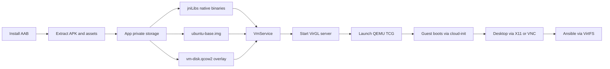

# Android Workspace Client - Requirements Specification

**Document ID:** WS-REQ-ANDROID-WORKSPACE-v1.0
**Status:** Draft
**Date:** 2026-07-06
**Classification:** Internal
**Specification:** [SPEC-ANDROID-WORKSPACE](../specifications/SPEC-ANDROID-WORKSPACE.md)
**Authors:** Workspace Engineering
**References:**
- [REQ-VM-HYPERVISOR](REQ-VM-HYPERVISOR.md) (desktop QEMU backend - shared patterns, Phase 2)
- [REQ-BOOT-LAYOUT](REQ-BOOT-LAYOUT.md) (boot directory conventions on other platforms)
- [AGENTS.md](../../AGENTS.md) (Universal Agent Rules)

---

## 1. Scope

This document specifies requirements for a native Android application that runs a
bundled Ubuntu ARM64 virtual machine inside the app sandbox. The app ships QEMU
(TCG), optional VirGL graphics acceleration, cloud-init provisioning, and hooks
for running Ansible playbooks. No device root, Termux, or per-device host setup
is required.

**In scope:**

- Android App Bundle (AAB) packaging and distribution
- Embedded `qemu-system-aarch64`, `qemu-img`, and VirGL server binaries
- Ubuntu 22.04/24.04 ARM64 cloud image provisioning via cloud-init
- Automated desktop environment setup (XFCE4)
- Ansible playbook staging and execution from the device
- Management UI (VM state, logs, settings)

**Out of scope:**

- Authoring or maintaining Ansible playbooks (consumes existing playbooks only)
- Android host kernel modification
- KVM acceleration (unavailable to unprivileged Android apps)
- Non-ARM64 Android devices
- iOS

---

## 2. Terminology

| Term | Definition |
|------|------------|
| **AAB** | Android App Bundle - Google Play publishing format with optional split APKs and asset delivery |
| **TCG** | QEMU Tiny Code Generator - software CPU emulation used when KVM is unavailable |
| **VirGL** | Virtio-GPU path that forwards guest OpenGL to the host GPU |
| **W^X** | Android SELinux policy: writable memory cannot be executable from app `filesDir` |
| **jniLibs workaround** | Ship QEMU/VirGL as `.so` under `jniLibs/` so the package manager extracts them to an executable native library path |
| **Asset delivery** | Play feature to ship large files (Ubuntu image) outside the base APK size limit |
| **VirtFS (9p)** | QEMU host-guest filesystem share for playbook directories |

---

## 3. System Context

The application runs entirely in its own UID sandbox (e.g. `/data/data/<package>/`).
It bundles QEMU, VirGL, and a baseline Ubuntu image. A foreground service manages
VM lifecycle. The UI exposes start/stop, logs, desktop access, and Ansible runs.



**Assumptions:**

- ARMv8/AArch64 SoC; GPU with OpenGL ES 3.2+ or Vulkan 1.0+
- Android API 29 (Android 10) or higher
- Target Ansible playbooks expect Ubuntu 22.04/24.04 AArch64 without custom kernel modules

---

## 4. Functional Requirements

### FR-1: Packaging and distribution

**FR-1.1** The app SHALL ship as an Android App Bundle (`.aab`) with split APKs for
architecture-specific native libraries (`arm64-v8a`).

**FR-1.2** Large artifacts (Ubuntu base image, optional QEMU assets) MAY use Play
asset delivery to stay within the base APK size limit (~150 MB).

**FR-1.3** The app SHALL embed native binaries for `qemu-system-aarch64`,
`qemu-img`, and `virgl_test_server_android`.

**FR-1.4** To satisfy W^X restrictions, these binaries SHALL be packaged as
shared libraries under `jniLibs/` (e.g. `lib/arm64-v8a/libqemu-system-aarch64.so`).
JNI or a bootstrap loader SHALL invoke them from the extracted native library path.

**FR-1.5** Gradle SHALL set `packagingOptions { jniLibs { useLegacyPackaging = true } }`
so native libraries are extracted uncompressed and remain executable.

**FR-1.6** A minimal Ubuntu cloud image (e.g. `ubuntu-24.04-minimal-cloudimg-arm64`)
SHALL ship as an app asset and extract to private storage on first launch
(e.g. `ubuntu-base.img`).

### FR-2: VM lifecycle and graphics

**FR-2.1** A foreground `VmService` SHALL manage states: Stopped, Booting, Running,
Paused.

**FR-2.2** Before QEMU starts, the service SHALL start `virgl_test_server_android`
and stop it when the VM stops.

**FR-2.3** QEMU SHALL launch with at minimum:

| Flag / option | Purpose |
|---------------|---------|
| `-accel tcg` | Software emulation (KVM not available) |
| `-cpu max,pauth-impdef=on` | Faster AArch64 guest boot under TCG |
| `-device virtio-gpu-gl-pci,virgl=on` | VirGL-enabled virtual GPU |
| `-display x11` | X11 socket output |
| `-vnc :0` | VNC fallback |

**FR-2.4** Storage SHALL use `qemu-img` to create a QCOW2 overlay (`vm-disk.qcow2`)
backed by the extracted base image. The base image SHALL remain unmodified.

**FR-2.5** On app removal or explicit stop, the service SHALL shut down the guest
via `system_powerdown` where possible to avoid filesystem corruption.

### FR-3: Image provisioning

**FR-3.1** First-boot provisioning SHALL use cloud-init via a virtual seed drive
(`seed.img` on a virtio block device).

**FR-3.2** Generated `user-data` / `meta-data` SHALL, at minimum:

1. Create a user account with SSH access
2. Install and enable `openssh-server`
3. Configure QEMU user networking with SSH port forward
 (e.g. `hostfwd=tcp::<host_port>-:22`)

**FR-3.3** Default working disk size SHALL be 12 GB, user-configurable via settings.
Resize SHALL use `qemu-img resize` before first boot.

### FR-4: Desktop environment

**FR-4.1** Cloud-init `runcmd` SHALL install a lightweight desktop environment
(XFCE4) and basic tools (`xterm`, `firefox`) on first boot.

**FR-4.2** Cloud-init SHALL write `/etc/profile.d/virgl.sh`:

```bash
export GALLIUM_DRIVER=virpipe
export MESA_GL_VERSION_OVERRIDE=4.0
```

**FR-4.3** A display manager (e.g. LightDM) SHALL start on boot and use the
X11 display provided by the host app.

### FR-5: Ansible integration

**FR-5.1** The UI SHALL let the user pick a playbook directory via the Storage
Access Framework and stage it for the guest.

**FR-5.2** The running VM SHALL expose the playbook directory via VirtFS:

```
-virtfs local,path=<playbooks>,mount_tag=host-playbooks,security_model=passthrough,id=playbooks
```

**FR-5.3** The UI SHALL provide a control to run Ansible inside the guest:

1. Connect over the forwarded SSH port
2. Mount the 9p share at `/mnt/playbooks`
3. Run `ansible-playbook -i /mnt/playbooks/inventory /mnt/playbooks/playbook.yml`

**FR-5.4** stdout/stderr from the playbook run SHALL stream to the UI log view.

### FR-6: Management UI

**FR-6.1** The UI SHALL use Jetpack Compose with a single activity and three
sections: Dashboard, Console, Settings.

**FR-6.2** Dashboard SHALL show VM power state, guest OS version, forwarded SSH
port, VirGL status, and disk usage.

**FR-6.3** Console SHALL provide:

- Open Desktop - launches Termux:X11 or a bundled VNC client
- Read-only log stream (QEMU, VirGL, cloud-init, Ansible)
- Run Ansible - file picker + execution (FR-5)

**FR-6.4** Settings SHALL expose RAM (2-8 GB), vCPU count (1-4), disk size, and
default playbook directory.

---

## 5. Non-Functional Requirements

### Performance

**NFR-1** QEMU SHALL use `pauth-impdef=on` under TCG to reduce AArch64 boot time.

**NFR-2** Cold start to usable desktop SHALL complete within 5 minutes on a
current flagship device (reference: Snapdragon 8 Gen 3 class).

**NFR-3** With VirGL enabled, basic 2D desktop interaction SHALL sustain at least
15 FPS; video playback target 30 FPS (VLC).

### Reliability

**NFR-4** VM management SHALL run in a foreground service with a persistent
notification so the OS does not kill QEMU under load.

**NFR-5** A watchdog SHALL detect an unresponsive QEMU process, attempt graceful
shutdown, and optionally restart.

**NFR-6** Swipe-away or device shutdown SHALL trigger guest ACPI shutdown when
the VM is running.

### Security

**NFR-7** The app SHALL NOT require root. All execution stays within the app UID
sandbox and standard Android permissions.

**NFR-8** Guest networking SHALL use QEMU user-mode NAT (`-netdev user`). The guest
SHALL NOT receive unrestricted access to the host LAN by default.

**NFR-9** Guest SSH credentials and Ansible vault passwords SHALL use
`EncryptedSharedPreferences`.

### Usability

**NFR-10** After install, the user SHALL need only storage permission and Start VM;
desktop and VirGL setup SHALL be automated on first boot.

**NFR-11** QEMU, cloud-init, and Ansible logs SHALL be viewable in-app and
exportable via the Android share sheet.

---

## 6. Implementation constraints

**GPL-2.0:** QEMU binaries bundled in the app are GPL-2.0. Ship `LICENSE` and `NOTICE`
with version and source URL. Android code launches QEMU as an external process (or via
the jniLibs `.so` repackaging trick); it does not link `libqemu`. Modified QEMU builds
require publishing modified source.

**SELinux / W^X:** Executables cannot run from `filesDir`. Package QEMU and VirGL
as `jniLibs` `.so` files; the system extracts them under
`/data/app/.../lib/arm64`, which is not `noexec`.

**No KVM:** Only TCG is available. Performance is sufficient for productivity
workloads, not native speed. `pauth-impdef=on` is required for acceptable
AArch64 boot times.

**Display:** Primary path is Termux:X11 via intent; bundled VNC client is the
fallback when X11 is unavailable.

**Image size:** Base Ubuntu image (~400 MB compressed) SHOULD use Play asset
delivery (install-time or fast-follow) so the initial download stays small.

---

## 7. Acceptance criteria

Test device reference: Pixel 8 Pro or equivalent AArch64 flagship.

| ID | Scenario | Expected result |
|----|----------|-----------------|
| AC-1 | Install AAB on clean device; grant storage | App installs; base image downloads; Dashboard opens |
| AC-2 | Tap Start VM | VirGL starts; QEMU launches; cloud-init completes; Open Desktop enabled within 5 min |
| AC-3 | Open Desktop; run `glxgears` in guest | Desktop visible via X11 or VNC; `glxgears` confirms VirGL (>100 FPS) |
| AC-4 | Select test playbook; Run Ansible | 9p mount succeeds; playbook runs; output in log stream |
| AC-5 | Swipe app away while VM running; reopen | Service still running; UI shows Running |
| AC-6 | Tap Stop VM | Guest shuts down cleanly; no orphan QEMU/VirGL processes |

---

## 8. Traceability

| Requirement group | Primary deliverable |
|-------------------|-------------------|
| FR-1 | Gradle build, AAB, asset delivery |
| FR-2 | `VmService`, QEMU argv builder |
| FR-3 | cloud-init seed generator |
| FR-4 | cloud-init `runcmd` templates |
| FR-5 | VirtFS mount + SSH exec bridge |
| FR-6 | Jetpack Compose UI |
| NFR-4-6 | Foreground service, watchdog |
| NFR-7-9 | Network config, credential storage |