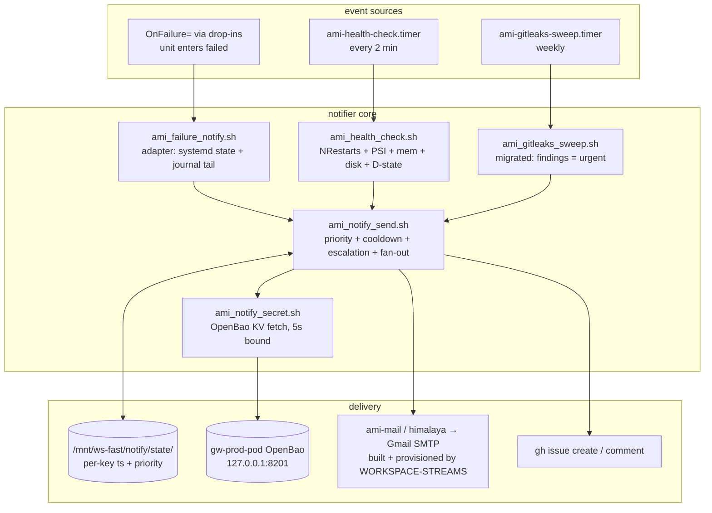

# Workspace Notification Engine - Technical Specification

**Document ID:** WS-SPEC-NOTIFICATIONS-v0.3
**Status:** Draft - Operator decisions recorded (REQ §9); ready for implementation
**Date:** 2026-09-13
**Classification:** Internal - Enterprise
**Requirements:** [REQ-NOTIFICATIONS](../requirements/REQ-NOTIFICATIONS.md)
**References:**
- [REQ-NOTIFICATIONS](../requirements/REQ-NOTIFICATIONS.md)
- [AUDIT-SYSTEMD-DEPLOYMENT-SOURCE-DRIFT-2026-08](../audits/AUDIT-SYSTEMD-DEPLOYMENT-SOURCE-DRIFT-2026-08.md)
- [scripts/services/ami_failure_notify.sh](../../scripts/services/ami_failure_notify.sh)
- [projects/WORKSPACE-GATEWAY/res/docker/openbao-entrypoint.sh](../../projects/WORKSPACE-GATEWAY/res/docker/openbao-entrypoint.sh) (OpenBao house pattern)
- [WORKSPACE-STREAMS docs/AMI-MAIL.md](../../projects/WORKSPACE-STREAMS/docs/AMI-MAIL.md) (mail channel: build, config, ansible role)
- [WORKSPACE-STREAMS docs/SPEC-MAIL.md](../../projects/WORKSPACE-STREAMS/docs/SPEC-MAIL.md) (channel architecture; §2 "managed build, not a bootstrap")
- [scripts/setup/hang-evidence-sampler.service](../../scripts/setup/hang-evidence-sampler.service) (deploy-pattern precedent)

---

## Overview

One shared, shell-only notification path for the workstation: systemd-native
event capture (`OnFailure=` template + timer-driven probes), one notifier
core with priority-tiered cooldowns and escalation fast-track, two remote
channels (himalaya email, GitHub issue) with fan-out by priority, and every
credential fetched at send time from the gateway OpenBao. No daemon, no new
runtime dependencies, user scope only.

---

## 1. Architecture



Design boundaries:

- **Capture is systemd-native.** Unit failures arrive via `OnFailure=`
  template instantiation - no polling, no process watching. Restart loops
  and resource limits are polled by one timer because systemd cannot
  express them as unit state.
- **Composition, priority, dedup, and delivery live in exactly one
  script.** Adapters (failure path, health checker, gitleaks sweep) only
  produce key/priority/subject/body. This is the single-seam rule: one
  place decides what "send" means.
- **Secrets exist in exactly one place** - the gateway OpenBao KV - and are
  fetched per delivery. The engine never writes secrets, never caches them
  on disk, and never logs them.
- **The forensic sampler is adjacent, not upstream.** The health checker
  probes live `/proc`, `df`, `systemctl`; sampler logs stay post-mortem
  evidence. Alerting off append-only logs would couple alert freshness to
  sampler health.

---

## 2. File Inventory

### Create

| Path | Purpose |
|------|---------|
| `scripts/services/ami_notify_send.sh` | Notifier core: priority, cooldown, escalation, fan-out, delivery |
| `scripts/services/ami_notify_secret.sh` | Bounded OpenBao KV fetch (one field per call) |
| `scripts/services/ami_health_check.sh` | Probe battery: NRestarts, PSI, mem, disk, D-state |
| `scripts/services/ami-failure-notify@.service` | systemd user template unit |
| `scripts/services/ami-health-check.service` | oneshot wrapper for the checker |
| `scripts/services/ami-health-check.timer` | 2-min cadence, `Persistent=true` |
| `scripts/services/ami-gitleaks-sweep.service` | oneshot wrapper for the migrated sweep |
| `scripts/services/ami-gitleaks-sweep.timer` | weekly cadence (`OnCalendar=Mon 04:00`, `Persistent=true`) |
| `scripts/services/ami-notify-selftest.service` | canary (`ExecStart=/bin/false`), dry-run wired |
| `scripts/services/himalaya.config.toml` | secret-free himalaya config template (`passwd.cmd` → secret helper) |
| `tests/unit/services/test_notify_send.py` | Cooldown, escalation, fan-out, dry-run, exit codes |
| `tests/unit/services/test_notify_secret.py` | KV response parsing, timeout/retry contract |
| `tests/unit/services/test_health_check.py` | Threshold + priority math, PSI/df/meminfo parsing (pure functions) |

### Edit

| Path | Change |
|------|--------|
| `scripts/services/ami_failure_notify.sh` | Send block replaced by `ami_notify_send.sh --priority urgent` call; capture logic unchanged |
| `scripts/services/ami_gitleaks_sweep.sh` | Send block replaced by core calls (findings `urgent`, clean-sweep `normal` digest); cron header removed |
| `Makefile` | `install-notifications`, `notifications-status`, `test-notifications`, `install-himalaya` (delegates to STREAMS build) targets |

### Unchanged

| Path | Reason |
|------|--------|
| `scripts/setup/hang-evidence-sampler.*` | Forensic scope only |

---

## 3. Notifier Core (`ami_notify_send.sh`)

### 3.1 Interface

```bash
ami_notify_send.sh --key <alert-key> --subject <text> \
    [--priority critical|urgent|normal] [--body <text>] [--body-file <path>]
```

Exit codes: `0` sent-or-cooled-down, `2` usage, `3` channel or secret
source unavailable, `4` channel invocation failed. Identical contract to the
existing adapter so `journalctl` triage stays uniform.

### 3.2 Priority, cooldown, escalation

State file: `/mnt/ws-fast/notify/state/<key>.ts` containing
`<epoch-seconds> <priority>` (one line, whitespace-separated). Override root
via `WORKSPACE_NOTIFY_STATE_DIR` (tests point it at a tmpdir).

```bash
rank() { case "$1" in critical) echo 3;; urgent) echo 2;; *) echo 1;; esac; }
now=$(date +%s); read -r last lastprio < "$state/$key.ts" 2>/dev/null || { last=0; lastprio=normal; }
cd_s=0
if (( now - last < cooldown_for_prio )); then cd_s=1; fi
if (( $(rank "$prio") > $(rank "$lastprio") )); then cd_s=0; log "escalation ${lastprio}->${prio}"; fi
if (( cd_s )); then log "skip (cooldown) key=$key prio=$prio"; exit 0; fi
# ... fan-out + deliver ...
printf '%s %s\n' "$now" "$prio" > "$state/$key.ts"
```

The `read … || { …; }` default is for a **missing** state file (first run),
a normal state; the subsequent write recreates it. Malformed content (no
integer epoch) MUST fail the send loudly (exit `2`), not reset quietly.

Cooldown defaults (REQ FR-2.1): `normal` 1800s, `urgent` 300s, `critical`
60s - env `WORKSPACE_NOTIFY_COOLDOWN_{NORMAL,URGENT,CRITICAL}`. Critical at
60s (not 0) bounds worst-case mail rate while staying fast enough to
re-alert within a single escalating incident.

### 3.3 Message

Subject prefix by priority: `[CRITICAL]` / `[URGENT]` / `[NOTICE]`.
`printf`-template body from subject + body + standard footer (host, key,
priority, timestamp, remediation line naming the journal command). Body cap
8 KiB, truncation marker past that (journal tails remain the authoritative
detail; the mail is the pager).

### 3.4 Fan-out

| Priority | himalaya email | gh issue |
|----------|----------------|----------|
| `critical` | yes | yes |
| `urgent` | yes | yes |
| `normal` | yes | no |

**gh issue idempotence** (REQ FR-2.3): before creating, search the target
repo for an open issue carrying the alert key in its title:

```bash
repo="${WORKSPACE_NOTIFY_GH_REPO:-Independent-AI-Labs/WORKSPACE-VM}"
num="$(GH_TOKEN="$tok" gh issue list -R "$repo" --state open \
    --search "in:title $key" --json number --jq '.[0].number' )"
if [ -n "$num" ]; then
    GH_TOKEN="$tok" gh issue comment "$num" -R "$repo" --body "$occurrence"
else
    GH_TOKEN="$tok" gh issue create -R "$repo" --title "[notify] $key $subject" --body "$body"
fi
```

Title embeds the alert key as the stable search handle; no label
dependencies. `GH_TOKEN` is exported per-invocation only (never written).
Each channel is rc-captured: one channel failing logs the failure and lets
the other proceed; overall exit reflects the worst channel outcome
(partial delivery is visible and non-fatal, exit `4`).

### 3.5 Dry run

`WORKSPACE_NOTIFY_DRY_RUN=1` (or the pre-existing
`WORKSPACE_FAILURE_NOTIFY_DRY_RUN=1`)
composes, resolves priority/cooldown/escalation, logs the full message, and
exits `0` without touching OpenBao or any channel. Cooldown state is NOT
advanced in dry-run.

---

## 4. Unit-Failure Path

### 4.1 Template unit (`ami-failure-notify@.service`)

```ini
[Unit]
Description=AMI failure notifier for %i

[Service]
Type=oneshot
Environment=WORKSPACE_NOTIFY_STATE_DIR=/mnt/ws-fast/notify/state
ExecStart=%h/WORKSPACE-VM/scripts/services/ami_failure_notify.sh %i
TimeoutStartSec=5min
```

`%h` keeps the unit portable across operator workstations (same convention
as the sampler unit). The adapter receives `%i` - the instance name - and
delegates to the core with priority `urgent`.

### 4.2 Drop-in wiring (`10-workspace-notify.conf`)

```ini
[Unit]
OnFailure=ami-failure-notify@%N.service
```

`%N` is the unit name **without** the `.service` suffix; instance expansion
yields `ami-failure-notify@zk-portal-dev.service` - no `…service.service`
artifact (2026-08 audit finding). Drop-ins are written by the installer to
`~/.config/systemd/user/<unit>.d/` for the REQ §6 list; unit sources in
other repositories are never edited, so wiring survives their redeploys.

Oneshot pod units (`*-pod.service`, `RemainAfterExit=yes`) fire the same
way: an `ExecStart` failure transitions them to `failed`.

### 4.3 Self-test canary

`ami-notify-selftest.service` (`ExecStart=/bin/false`) carries the standard
drop-in plus a `20-dryrun.conf` override setting
`WORKSPACE_NOTIFY_DRY_RUN=1`, so `make test-notifications` proves template
resolution, drop-in wiring, and adapter execution without touching OpenBao
or any inbox. Without a systemd user session the target prints an explicit
skip reason and exits `0` (house NFR precedent - skip honestly).

---

## 5. Health Checker (`ami_health_check.sh`)

Oneshot, timer-driven: `OnBootSec=2min`,
`OnUnitActiveSec=2min` with `AccuracySec=30s` and `Persistent=true` (missed
runs during downtime run late instead of being lost). Probes are
sub-second; 2 minutes halves restart-loop detection latency versus 5 and
matches the portal-healthcheck precedent.

Each probe is rc-captured; one failing probe logs and never aborts the
battery (REQ FR-5.3). Output to the journal is one summary line per probe;
alert bodies carry measured value, threshold, and remediation command.

### 5.1 Probe table

Every row maps one measured value to a priority via two static thresholds
(`none` below both). Threshold env names: `WORKSPACE_NOTIFY_TH_<KEY>_{U,C}`.

| Probe | Source | Alert key | Urgent at | Critical at |
|-------|--------|-----------|-----------|-------------|
| PSI io | `/proc/pressure/io` `some avg10` | `psi-io` | > 50 | > 80 |
| PSI cpu | `/proc/pressure/cpu` `some avg10` | `psi-cpu` | > 90 | - |
| PSI memory | `/proc/pressure/memory` `some avg10` | `psi-mem` | > 50 | > 80 |
| Memory | `/proc/meminfo` `MemAvailable` | `mem-avail` | < 8 GiB | < 4 GiB |
| D-state | `ps -eo stat` count `^D` | `dstate` | > 20 | > 50 |
| FS `/` | `df -P` | `disk-root` | > 85% | > 95% |
| FS `/mnt/ws-fast` | `df -P` | `disk-fast` | > 85% | > 95% |
| Restart loops | `systemctl --user show -p NRestarts` per managed unit | `restart:<unit>` | > 10 | - |

### 5.2 Calibration rationale (fixed, static - REQ §10)

Idle baseline 2026-09-13: PSI ≈ 0.00 everywhere, D-state 0, MemAvailable
87 GiB of 128 GiB, `/` 56%, fast 22%. Hang-class reality (2026-09): PSI io
avg10 pinned ~100, D-state in the hundreds. Urgent levels sit roughly an
order of magnitude above healthy noise and well below incident floor;
critical marks "machine dying now" (PSI > 80, memory < 4 GiB, disk > 95%).
No adaptive logic: if a workload legitimately sits near a threshold, the
env override is the tuning knob.

### 5.3 Parsing

PSI: `grep '^some' /proc/pressure/<d>` then `grep -oE 'avg10=[0-9.]+'` -
the same extraction style the sampler uses, one idiom across the repo.
`df`: `-P` + awk field 5 minus `%`. `MemAvailable`: `/proc/meminfo` direct.
`NRestarts`: `systemctl --user show <unit> --property=NRestarts,ActiveState`
parsed with the adapter's read-loop style. Missing `/proc/pressure/*` ⇒
logged skip (kernel without PSI).

NRestarts is cumulative since the last `systemctl reset-failed`/unit-file
reset; the checker reports the raw counter and cooldown dedups mail. After
an incident is fixed, `systemctl --user reset-failed <unit>` re-arms a
clean baseline; the runbook documents this.

---

## 6. Channel Build - Owned by WORKSPACE-STREAMS

The himalaya binary is a **managed build, not a bootstrap** (SPEC-MAIL §2 -
"all build logic lives in WORKSPACE-STREAMS"). This engine adds no download,
pins manifest, or build script of its own.

`make install-himalaya` (this repo) is a thin delegation:

```makefile
install-himalaya: ## Build/install himalaya via the STREAMS managed build
	$(MAKE) -C projects/WORKSPACE-STREAMS build-himalaya
```

`make -C projects/WORKSPACE-STREAMS build-himalaya` compiles the vendored
fork (`projects/WORKSPACE-STREAMS/himalaya/`, branch `ami`) and installs
`.boot-linux/bin/himalaya` plus the `ami-mail` symlink - the exact path the
existing `ami_failure_notify.sh` already assumes. `install-notifications`
SHALL verify the binary through the boot-dir seam and fail with the
remediation `make install-himalaya` when absent (REQ FR-7.4).

Config provisioning has two documented shapes (AMI-MAIL.md):

| Shape | Where | Mechanism |
|-------|-------|-----------|
| Full server provisioning | Matrix deployments | STREAMS Ansible role `ami_mail` (renders config.toml, OAuth2 via Secret Service keyring, SMTP via exim-relay `127.0.0.1:2525`) |
| Workstation engine config (v1) | this machine | tracked secret-free template installed by `install-notifications` (§7.2): direct Gmail SMTP, password via `passwd.cmd` → OpenBao |

The `gh` binary is already bootstrapped in the boot dir; no
`gh auth login` state is used - the token arrives per-invocation from
OpenBao (REQ FR-7.2).

---

## 7. Secrets - OpenBao (design + runbook)

### 7.1 Runtime contract (`ami_notify_secret.sh`)

```bash
ami_notify_secret.sh <field>   # field: gmail_app_password | gh_token
```

- Address: `WORKSPACE_NOTIFY_BAO_ADDR` default `http://127.0.0.1:8201`
  (rootlessport forward of the gw-prod pod's `:8200`)
- Token: `WORKSPACE_NOTIFY_BAO_TOKEN`, else read `OPENBAO_TOKEN=` from
  `projects/WORKSPACE-GATEWAY/.env` (the gateway's established fixed-ID
  service-token pattern; path resolved from the workspace root seam, never
  a hardcoded absolute)
- Fetch: `curl -fsS -m 5 -H "X-Vault-Token: $tok" "$addr/v1/secret/data/workspace/notify"`
  piped to `jq -r ".data.data.$field"` (system jq; curl+jq are the same
  system utilities the gateway entrypoint itself relies on)
- One retry after 10s (early-boot OnFailure can race the gateway pod start),
  then exit `3` with remediation: `systemctl --user status gw-prod-pod.service`
- Never logs field values, tokens, or response bodies; failure output is
  status codes and paths only

### 7.2 himalaya config (tracked template, zero secrets)

`scripts/services/himalaya.config.toml` → installed to
`~/.config/himalaya/config.toml` (mode 0600) by `install-notifications`:

```toml
[accounts.polymarket]
default = true
email = "independentailabs@gmail.com"

[accounts.polymarket.mail]
type = "smtp"
host = "smtp.gmail.com"
port = 465
encryption = "ssl"
login = "independentailabs@gmail.com"
passwd.cmd = "%h/WORKSPACE-VM/scripts/services/ami_notify_secret.sh gmail_app_password"
```

`passwd.cmd` executes at send time - the password exists only in OpenBao and
in himalaya's process memory.

### 7.3 Operator-only provisioning runbook

Precedent: STREAMS' ami-mail already reads SMTP credentials from OpenBao on
server deployments (STREAMS README FAQ); this engine applies the same
rule to the workstation. The agent never performs these steps and no secret
ever enters a repository or a test fixture:

1. Create a Google App Password for independentailabs@gmail.com
2. Create a GitHub fine-grained token (repo: issues read/write on
   `Independent-AI-Labs/WORKSPACE-VM`, nothing else)
3. Write both to OpenBao KV once (token from
   `projects/WORKSPACE-GATEWAY/.env`):

```bash
BAO_ADDR=http://127.0.0.1:8201
BAO_TOKEN="$(grep -oP '(?<=^OPENBAO_TOKEN=).+' projects/WORKSPACE-GATEWAY/.env)"
curl -fsS -H "X-Vault-Token: $BAO_TOKEN" \
    -d '{"data":{"gmail_app_password":"<app-password>","gh_token":"<gh-token>"}}' \
    "$BAO_ADDR/v1/secret/data/workspace/notify"
```

4. Round-trip both channels (REQ AC-7):
   `make install-notifications && ami_notify_send.sh --key selftest \
   --subject round-trip --priority urgent --body "channel verification"`
   then confirm the email arrived and the issue exists; close the issue
5. Optional hardening (later phase): replace the shared service token with
   a dedicated OpenBao policy/token scoped to `secret/data/workspace/notify`

---

## 8. Make Targets

```makefile
install-notifications:   ## units + drop-ins + himalaya config + enable timers
notifications-status:    ## timers + last checker output + notifier journal + cooldown state
install-himalaya:        ## pinned binary into boot dir
test-notifications:      ## canary dry-run wiring proof (skips without user session)
```

Deploy mechanics copy `install-diagnostics` verbatim: `install -D -m 644`
units, `install -d` for drop-in dirs, `systemctl --user daemon-reload`,
`enable --now` the timers, then `status` for immediate feedback.

---

## 9. Test Strategy

| Layer | What | How |
|-------|------|-----|
| Unit | Cooldown skip/rearm per priority; escalation bypass + rank logic; state-file lifecycle incl. malformed line; fan-out selection; dry-run non-advancing; exit codes | `tests/unit/services/test_notify_send.py`, `WORKSPACE_NOTIFY_STATE_DIR` on tmpdir, dry-run env |
| Unit | KV JSON extraction; timeout/retry contract; no-secret-in-output invariant | `tests/unit/services/test_notify_secret.py` against fixture responses |
| Unit | Probe → priority mapping table; PSI/meminfo/df/NRestarts parsing as pure functions fed fixture lines | `tests/unit/services/test_health_check.py` |
| E2E | Template + drop-in + adapter wiring | `make test-notifications`: start canary, poll journal for `[ami-failure-notify]` dry-run lines, assert instance id; explicit skip without a systemd user session |
| Operator | Real channel round-trip, both channels | Runbook §7.3 step 4, manual sign-off (REQ AC-7) |

All unit tests run inside the standard pytest suite: `make check`, the
commit-time gates, and CI see them identically to every other component
(REQ FR-8.4). Nothing about this feature lives outside the normal hook/gate
chain.

---

## 10. Gitleaks Sweep Migration

`ami_gitleaks_sweep.sh` keeps its scan logic and report layout; only the
send block changes:

- findings > 0 → `ami_notify_send.sh --key gitleaks --priority urgent
  --body-file <summary>` (email + gh issue; the issue accumulates per-week
  comments for one open incident until closed)
- clean week → `--key gitleaks-clean --priority normal` digest (email only,
  weekly cooldown is naturally satisfied by cadence)
- himalaya call and its env plumbing deleted from the sweep - the core owns
  delivery end-to-end
- weekly cron entry retired; `ami-gitleaks-sweep.timer`
  (`OnCalendar=Mon 04:00`, `Persistent=true`) deployed by
  `install-notifications`
- sweep unit tests: arg-parse and core-invocation lines asserted in dry-run
  (the scan itself needs gitleaks + repos and stays integration-skip)

---

## 11. Acceptance Matrix

Maps 1:1 to REQ §7; execution status tracked there.

| AC | Verification in this SPEC |
|----|---------------------------|
| AC-2 | §9 unit tests |
| AC-3 | §4.2 drop-ins, §8 installer |
| AC-4 | §4.3 canary, §8 `test-notifications` |
| AC-5 | §3.2 cooldown + escalation, §9 unit tests |
| AC-6 | §6 bootstrap |
| AC-7 | §7.3 runbook step 4 |
| AC-8 | §7 design; grep audit in CI (existing secret gates) |
| AC-11 | §10 sweep migration |

---

## 12. Implementation Order

1. REQ/SPEC committed (this pair, v0.2)
2. `ami_notify_secret.sh` + `ami_notify_send.sh` + unit tests (core first -
   everything else delegates; OpenBao contract is the riskiest seam)
3. Adapter refactor (`ami_failure_notify.sh`) + template unit + drop-ins +
   installer target
4. `ami_health_check.sh` + timer + tests
5. `make install-himalaya` (delegation to the STREAMS managed build) +
   config template; operator runs runbook §7.3
6. gitleaks sweep migration + timers; retire cron entry (operator removes
   the cron line - deletion is a manual action by house rule)
7. `make test-notifications` canary; `make check`; commit through the gates
8. Operator round-trip sign-off on both channels (AC-7)

---

## 13. Implementation Status

Status as of 2026-09-13: **not implemented** - specification drafted at
v0.2 with operator decisions from REQ §9 incorporated; implementation may
begin per §12 order. No code exists yet by design.
