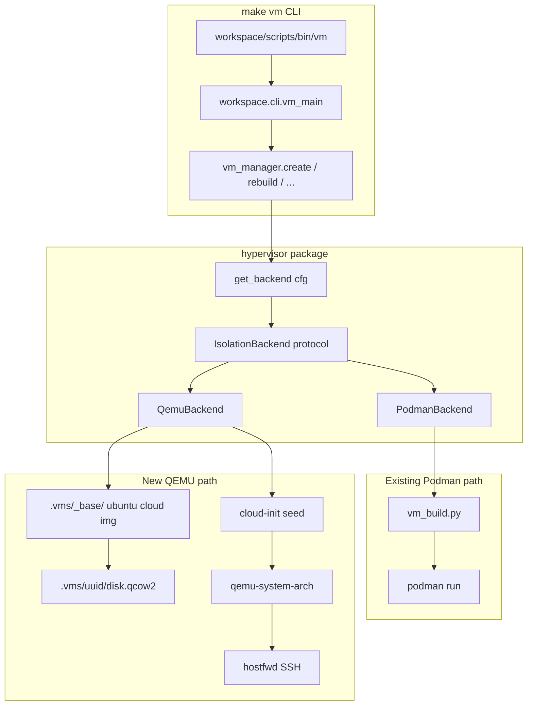

# VM Hypervisor Extension - Technical Specification

**Document ID:** WS-SPEC-VM-HYPERVISOR-v1.0
**Status:** Draft
**Date:** 2026-07-11
**Classification:** Internal - Enterprise
**Requirements:** [REQ-VM-HYPERVISOR](../requirements/REQ-VM-HYPERVISOR.md)
**References:**
- [REQ-VM-HYPERVISOR](../requirements/REQ-VM-HYPERVISOR.md)
- [REQ-BOOT-LAYOUT](../requirements/REQ-BOOT-LAYOUT.md)
- [REQ-OPENVPN](../requirements/REQ-OPENVPN.md)
- [REQ-ANDROID-WORKSPACE](../requirements/REQ-ANDROID-WORKSPACE.md)
- [workspace/types/vm.py](../../workspace/types/vm.py)
- [workspace/cli/vm_manager.py](../../workspace/cli/vm_manager.py)
- [workspace/cli/vm_build.py](../../workspace/cli/vm_build.py)
- [workspace/config/vm-template.yaml](../../workspace/config/vm-template.yaml)

---

## Overview

Extend `make vm` with a pluggable **isolation backend** layer. Podman remains the
default fast path for rootless agent containers. QEMU adds a true VM boundary for
host protection and WORKSPACE-GUARD authoritative testing.

Both backends share:

- YAML config → `VMConfig` pydantic model
- UUID7 lifecycle under `.vms/<uuid>/`
- `components` → `make install-ci` provisioning model
- `vm create` CLI entry point

They differ in spawn mechanics, health checks, and security field interpretation.

---

## 1. Architecture



### 1.1 Module layout (POC)

```
workspace/cli/
 hypervisor/
 __init__.py # get_backend(cfg) -> IsolationBackend
 base.py # IsolationBackend protocol
 podman_backend.py # delegates to existing vm_build/vm_manager paths
 qemu_backend.py # spawn, wait-ssh, stop, destroy
 vm_manager.py # branch on cfg.isolation.backend
```

### 1.2 `IsolationBackend` protocol (POC surface)

```python
class IsolationBackend(Protocol):
    def create(self, uuid: str, cfg: VMConfig, vm_dir: Path) -> None: ...
    def start(self, uuid: str) -> None: ...
    def stop(self, uuid: str) -> None: ...
    def destroy(self, uuid: str, *, purge: bool = False) -> None: ...
    def exec(self, uuid: str, cmd: list[str]) -> subprocess.CompletedProcess: ...
    def ssh_endpoint(self, uuid: str) -> tuple[str, int]: ...
    def status(self, uuid: str) -> dict[str, str]: ...
    def backend_name(self) -> str: ...
```

`PodmanBackend.create` SHALL call the existing `vm_manager.create` body
(extracted unchanged). `QemuBackend` implements the new path.

---

## 2. File Inventory

### Create

| Path | Purpose |
|------|---------|
| `docs/REQ-VM-HYPERVISOR.md` | Requirements (this initiative) |
| `docs/SPEC-VM-HYPERVISOR.md` | Technical spec (this document) |
| `workspace/cli/hypervisor/__init__.py` | `get_backend()` factory |
| `workspace/cli/hypervisor/base.py` | `IsolationBackend` protocol |
| `workspace/cli/hypervisor/podman_backend.py` | Thin wrapper over existing Podman flow |
| `workspace/cli/hypervisor/qemu_backend.py` | QEMU lifecycle orchestration (subprocess only) |
| `workspace/cli/hypervisor/qemu_argv.py` | Pure argv/firmware path builder (no I/O) |
| `workspace/cli/hypervisor/qemu_images.py` | Base image download, overlay, cloud-localds seed |
| `workspace/cli/hypervisor/qemu_resolve.py` | Binary/firmware resolution from boot-dir |
| `workspace/config/vm-poc-qemu.yaml` | Minimal QEMU POC config |
| `workspace/scripts/bootstrap/bootstrap_qemu.sh` | Install/symlink QEMU, firmware, GPL notices |
| `res/qemu-pins.yaml` | Pinned versions, checksums, source URLs |
| `res/vm-images.yaml` | Ubuntu cloud image URLs and SHA256 |
| `tests/e2e/test_vm_qemu_poc.py` | Boot + SSH + `uname -a` E2E |
| `tests/unit/types/test_vm_isolation_config.py` | Schema validation unit tests |
| `tests/unit/cli/hypervisor/test_qemu_argv.py` | Argv builder unit tests |

### Edit

| Path | Change |
|------|--------|
| `workspace/types/vm.py` | Add `VMIsolationConfig`, `VMQemuConfig`; wire into `VMConfig` |
| `workspace/config/vm-template.yaml` | Document `isolation` block with defaults |
| `workspace/config/bootstrap-components.yaml` | Add `qemu` component |
| `config/system-deps.yaml` | Add `cloud-localds`, optional `qemu-utils` |
| `workspace/cli/vm_manager.py` | Dispatch `create` on `cfg.isolation.backend` |
| `workspace/scripts/bin/vm` | Backend-aware `list`, `shell`, `stop`, `delete` (partial POC) |
| `Makefile` | Add `install-qemu` target |
| `docs/MIGRATION-PLAN.md` | Cross-reference hypervisor extension (optional) |

### Unchanged (Podman path)

| Path | Reason |
|------|--------|
| `workspace/cli/vm_build.py` | Podman image build + run args - no QEMU changes |
| `workspace/scripts/templates/Dockerfile.vm.j2` | Container-only |
| `tests/e2e/test_vm_security.py` | Podman security assertions |

---

## 3. YAML Schema Extension

Add to `workspace/types/vm.py`:

```python
class VMQemuConfig(BaseModel):
    guest_arch: Literal["aarch64", "x86_64"] = "aarch64"
    accel: Literal["auto", "kvm", "hvf", "whpx", "tcg"] = "auto"
    disk_gb: int = 20
    ssh_host_port: int = 0  # 0 = auto-allocate
    image: str = "workspace-vm-base-ubuntu-24.04-aarch64.qcow2"


class VMIsolationConfig(BaseModel):
    backend: Literal["podman", "qemu"] = "podman"
    qemu: VMQemuConfig = Field(default_factory=VMQemuConfig)
```

Add to `VMConfig`:

```python
isolation: VMIsolationConfig = Field(default_factory=VMIsolationConfig)
```

### 3.1 `vm-template.yaml` addition

```yaml
# --- Isolation backend ---
# DEFAULT: podman - existing rootless agent containers (no breaking change).
# Use qemu for full Linux guest / WORKSPACE-GUARD cap E2E. See docs/REQ-VM-HYPERVISOR.md.
isolation:
 backend: podman # podman | qemu
 qemu:
 guest_arch: aarch64 # aarch64 | x86_64
 accel: auto # auto | kvm | hvf | whpx | tcg
 disk_gb: 20
 ssh_host_port: 0 # 0 = auto-allocate ephemeral port
 image: workspace-vm-base-ubuntu-24.04-aarch64.qcow2
```

### 3.2 Field applicability by backend

| Field | Podman | QEMU |
|-------|--------|------|
| `components`, `extra_apt` | install-ci in container build | SSH provision: rsync + `make install-ci` on guest disk |
| `resources.memory`, `resources.cpus` | podman `--memory`, `--cpus` | QEMU `-m`, `-smp` |
| `security.*` | podman run flags | cloud-init hardening (no direct mapping) |
| `network.mode: openvpn` | supported | **not in POC** - use podman |
| `network.mode: bridge` | Traefik + mTLS | **not in POC** |
| `web_ui` | opencode Traefik | **deferred** - SSH only in POC |
| `mounts` | podman volume binds | read-only virtfs/9p only (v1) |

---

## 4. `.vms/` Directory Layout

### 4.1 Shared per-VM (`Podman` and `QEMU`)

```
.vms/<uuid>/
 vm.yaml # frozen config at create time
 vm-install-defaults.yaml
 password # Podman: container password; QEMU: optional guest password
 certs/ # Podman mTLS; QEMU: unused in POC
```

### 4.2 Podman-only additions

```
 pid # container PID on host
```

Podman also creates named volumes: `<uuid>-workspace`, `<uuid>-transcripts`, `<uuid>-cache`.

### 4.3 QEMU-only additions

```
.vms/<uuid>/
 qemu.pid # host PID of qemu-system-* process
 ssh_port # forwarded localhost port (e.g. 55222)
 disk.qcow2 # per-VM overlay
 cloud-init/
 user-data
 meta-data
 seed.img # FAT seed for -drive file=seed.img
 qemu.log # optional stdout/stderr capture
 provision.log # install-ci / rsync output from qemu_provision.py
```

### 4.4 Shared base cache

```
.vms/_base/
 workspace-vm-base-ubuntu-24.04-aarch64.qcow2 # downloaded once
 workspace-vm-base-ubuntu-24.04-x86_64.qcow2 # optional second arch
```

Base image bootstrap:

1. On first QEMU create, ensure `.vms/_base/` exists
2. Download Ubuntu minimal cloud image if missing (checksum verified)
3. `qemu-img create -f qcow2 -b <base> -F qcow2 <vm_dir>/disk.qcow2`
4. `qemu-img resize <vm_dir>/disk.qcow2 <disk_gb>G`

---

## 5. PodmanBackend

`PodmanBackend` is a **thin adapter**. `create()` SHALL execute the current
`vm_manager.create` logic without modification:

1. `_ensure_podman_machine()`
2. Stage VPN assets, build context, render Dockerfile, `podman build`
3. Create volumes, certs, bridge network, netns preflight
4. `podman run` with `_build_run_args` security flags
5. `_wait_healthy` via container healthcheck

No QEMU artifacts. `cfg.isolation.backend` is ignored except for backend selection.

---

## 6. QemuBackend

### 6.1 Create sequence

```
create(uuid, cfg, vm_dir):
 1. resolve_qemu_binary(guest_arch) # boot-dir → PATH
 2. resolve_accel(cfg.isolation.qemu) # auto → kvm/hvf/whpx/tcg
 3. ensure_base_image(image_name)
 4. create_overlay(vm_dir/disk.qcow2)
 5. generate_cloud_init(cfg, vm_dir) # user workspace, SSH pubkey, optional install-ci
 6. allocate_ssh_port() # write ssh_port file
 7. build_argv() → subprocess.Popen
 8. write qemu.pid
 9. wait_ssh_healthy(host, port) # reuse timeout pattern from vm_core._wait_healthy
10. if cfg.components non-empty: qemu_provision.run_install_ci(...)
```

### 6.2 QEMU argv (POC - aarch64 Linux guest)

Built by `qemu_argv.py` from boot-dir paths. Firmware is mandatory for `virt`.

```bash
qemu-system-aarch64 \
 -accel kvm|hvf|tcg \
 -cpu max \
 -machine virt,gic-version=3,acpi=on \
 -m 4096 \
 -smp 2 \
 -bios <boot-dir>/share/qemu/firmware/QEMU_EFI.fd \
 -drive file=.vms/<uuid>/disk.qcow2,if=virtio,format=qcow2 \
 -drive file=.vms/<uuid>/cloud-init/seed.img,format=raw,if=virtio \
 -netdev user,id=net0,hostfwd=tcp:127.0.0.1:<ssh_port>-:22 \
 -device virtio-net-pci,netdev=net0 \
 -device virtio-rng-pci \
 -fsdev local,id=ws0,path=<workspace_root>,security_model=none,readonly=on \
 -device virtio-9p-pci,fsdev=ws0,mount_tag=workspace \
 -display none \
 -pidfile .vms/<uuid>/qemu.pid \
 -daemonize
```

`<workspace_root>` is `find_workspace_root()` (WORKSPACE-VM repo root). The 9p share
is read-only on the host; guest writes go to `/opt/workspace` on the QCOW2 overlay only.

- Linux + KVM: `-accel kvm`, `-cpu host` when `guest_arch` matches host
- macOS: `-accel hvf`, `-cpu max` (no `host` CPU on HVF for aarch64 guest)
- Fallback: `-accel tcg`, `-cpu max`

x86_64 guest uses `qemu-system-x86_64`, `-machine q35`, OVMF pflash or `-bios` per pin file.

### 6.3 Cloud-init `user-data` (POC minimum)

```yaml
#cloud-config
users:
 - name: workspace
 sudo: ALL=(ALL) NOPASSWD:ALL
 shell: /bin/bash
 ssh_authorized_keys:
 - <build-time ed25519 pubkey>
package_update: true
packages:
 - openssh-server
 - git
 - curl
 - rsync
 - make
 - build-essential
users:
 - name: agent
   uid: 1001
   shell: /bin/bash
   groups: [workspace]
runcmd:
 - systemctl enable --now ssh
 - mkdir -p /mnt/workspace-ro
 - mount -t 9p -o trans=virtio,version=9p2000.L,ro workspace /mnt/workspace-ro
```

SSH key generation reuses `_prepare_build_ssh_key` pattern from `vm_build.py`.
`make install-ci` is **not** run in cloud-init (timeouts); `qemu_provision.py` runs
it over SSH after health check when `components` is non-empty.

### 6.4 Health check

Replace container healthcheck with SSH probe:

```bash
ssh -o StrictHostKeyChecking=no -o ConnectTimeout=5 \
 -p "$ssh_port" workspace@127.0.0.1 echo ok
```

Poll until success or timeout (same order of magnitude as existing `_wait_healthy`).

### 6.5 Stop / destroy

- **stop:** `qemu-monitor` `system_powerdown` if monitor available; else SIGTERM to PID in `qemu.pid`; wait up to 30s; SIGKILL fallback
- **destroy:** stop + `rm -rf .vms/<uuid>/` (preserve `_base/`)

### 6.6 Guest provisioning and rsync profiles

`workspace/cli/hypervisor/qemu_provision.py` orchestrates post-boot setup:

1. Wait for `/mnt/workspace-ro` (cloud-init mount).
2. Rsync selected paths from RO mount to `/opt/workspace` (guest disk).
3. `cd /opt/workspace && make init && make install-ci INSTALL_DEFAULTS=...`
4. Stream output to `.vms/<uuid>/provision.log`.

| Profile | Config | Rsync scope | install-ci |
|---------|--------|-------------|------------|
| `poc` | `vm-poc-qemu.yaml` | None | No |
| `guard` | `vm-guard-qemu.yaml` | Skeleton + `projects/CI` + `projects/WORKSPACE-GUARD` | Minimal (git, rust via init) |
| `full-ci` | `vm-full-ci-qemu.yaml` | Skeleton + required `projects/*` | Yes (13 default components) |

**Always excluded from rsync:** `.vms/`, `.venv/`, `node_modules/`, `__pycache__/`.

**Optional (`QEMU_RSYNC_BOOT=1`, same host arch only):** copy host `.boot-linux/` into
guest to skip cold downloads. macOS host `.boot-macos/` is never copied (wrong arch).

Environment knobs:

| Variable | Default | Effect |
|----------|---------|--------|
| `QEMU_PROVISION_PROFILE` | derived from config | `poc` / `guard` / `full-ci` |
| `QEMU_RSYNC_BOOT` | `0` | Copy pre-built `.boot-linux/` when `1` |
| `QEMU_PROVISION_TIMEOUT` | `3600` | Seconds for install-ci |

Disk guidance: `disk_gb: 12` for POC; `48` for full-ci (base image + overlay + install artifacts).

### 6.7 E2E storage cleanup

QEMU E2E tests (`tests/e2e/test_vm_qemu_*.py`) MUST NOT persist per-VM overlays:

| Artifact | After E2E | Rationale |
|----------|-----------|-----------|
| `.vms/<uuid>/` (overlay, cloud-init, logs) | **Deleted** | `qemu_tracker` fixture + session reclaim |
| `.vms/_base/` (shared Ubuntu image) | **Retained** | Avoid re-downloading ~600MB per run |
| Failed partial creates | **Reclaimed** | `cleanup_orphan_qemu_vms()` on session end |

Debug only: set `QEMU_E2E_KEEP_VM=1` to skip destroy (not for CI).

---

## 7. Accelerator Resolution

```python
def resolve_accel(requested: str, host_os: str, qemu_bin: Path) -> str:
 if requested != "auto":
 return requested
 if host_os == "linux":
 return "kvm" if _probe_accel(qemu_bin, "kvm") else "tcg"
 if host_os == "darwin":
 return "hvf" if _probe_accel(qemu_bin, "hvf") else "tcg"
 if host_os == "win32":
 return "whpx" if _probe_accel(qemu_bin, "whpx") else "tcg"
 return "tcg" # Android / unknown
```

`_probe_accel` runs `qemu-system-* -accel <name> -machine none -display none` and
checks exit code.

---

## 8. CLI Parity Matrix

| Subcommand | Podman (existing) | QEMU (POC) |
|------------|-------------------|------------|
| `create` | full | full |
| `rebuild` | full | **deferred** |
| `start` | `podman start` | spawn if stopped |
| `stop` | `podman stop` | ACPI / SIGTERM |
| `delete` | `podman rm` + volumes | kill + rm vm_dir |
| `shell` | `podman exec -it` | `ssh workspace@127.0.0.1 -p <port>` |
| `exec` | `podman exec` | `ssh ... cmd` |
| `logs` | `podman logs` | `tail qemu.log` |
| `list` | `podman ps --filter label=...` | scan `.vms/*/qemu.pid` + process table |
| `sync` | existing | **deferred** |

`vm` shell script reads `vm.yaml` → `isolation.backend` to dispatch.

---

## 9. GPL compliance and module boundaries

### 9.1 Legal model

QEMU is GPL-2.0. WORKSPACE-VM Python and shell code is proprietary to the workspace
and invokes QEMU as a **separate program** (GPL FAQ: running an external program is
not creating a derivative work). Distribution obligations attach to **QEMU binaries**
we ship or symlink into `<boot-dir>/`, not to the orchestrator.

| Layer | License | QEMU coupling |
|-------|---------|---------------|
| `workspace/cli/hypervisor/*.py` | Workspace | `subprocess.run([qemu_bin, ...])` only |
| `workspace/scripts/bootstrap/bootstrap_qemu.sh` | Workspace | Installs upstream binaries + notices |
| `<boot-dir>/bin/qemu-system-*` | GPL-2.0 | Upstream, unmodified |
| `<boot-dir>/share/qemu/firmware/*` | BSD (EDK2) | Upstream distro packages |
| `.vms/_base/*.qcow2` | Ubuntu terms | Guest image, not linked |
| Guest cloud-init seed | Workspace-generated data | Not a derivative of QEMU |

**Prohibited in v1:**

- `import ctypes` / `cffi` loading `libqemu`
- Static linking QEMU into Rust/Python extensions
- Patching QEMU without publishing modified source

### 9.2 Boot-directory notice bundle

After `bootstrap_qemu.sh`:

```
.boot-linux/share/qemu/
 LICENSE # GPL-2.0 full text (from qemu.org or package)
 NOTICE # version, tarball URL, build date
 firmware/
 QEMU_EFI.fd # from qemu-efi / edk2-aarch64 (Linux apt)
```

`NOTICE` template:

```
QEMU system emulator
Version: <from res/qemu-pins.yaml>
Binary: qemu-system-aarch64, qemu-img
Source: https://download.qemu.org/qemu-<version>.tar.xz
License: GNU General Public License v2.0
```

### 9.3 Code layout rule

```
hypervisor/
 qemu_argv.py # pure functions - argv, firmware paths (unit-testable)
 qemu_resolve.py # boot-dir → Path, PATH fallback with warning
 qemu_images.py # download, qcow2 overlay, cloud-localds
 qemu_backend.py # IsolationBackend - wires the above, subprocess only
```

No single file imports QEMU internals. `qemu_argv.py` has zero subprocess calls so
tests do not need QEMU installed.

---

## 10. QEMU bootstrap

### 10.1 Component registration

`workspace/config/bootstrap-components.yaml`:

```yaml
 - name: qemu
 label: 'QEMU'
 description: 'VM hypervisor (GPL-2.0, subprocess-only integration)'
 type: script
 group: 'Infrastructure & Orchestration'
 script: 'bootstrap_qemu.sh'
 detect_path: '.boot-linux/bin/qemu-system-aarch64'
 version_cmd: ['.boot-linux/bin/qemu-system-aarch64', '--version']
 version_pattern: 'QEMU emulator version (\d+\.\d+\.\d+)'
```

macOS `detect_path` resolves via boot-dir resolver (`.boot-macos/...`).

### 10.2 `res/qemu-pins.yaml` schema

```yaml
version: 1
qemu:
 version: "9.2.1"
 source_url: "https://download.qemu.org/qemu-9.2.1.tar.xz"
 source_sha256: "<sha256>"
linux:
 apt_packages:
 - qemu-system-arm
 - qemu-system-x86
 - qemu-utils
 - qemu-efi-aarch64 # provides QEMU_EFI.fd
 min_version: "9.2.0"
darwin:
 brew_package: qemu
 min_version: "9.2.0"
firmware:
 aarch64_edk2:
 linux_path: /usr/share/qemu-efi-aarch64/QEMU_EFI.fd
 darwin_path: <brew-prefix>/share/qemu/edk2-aarch64-code.fd
images:
 ubuntu_2404_arm64:
 url: "https://cloud-images.ubuntu.com/releases/24.04/release/ubuntu-24.04-server-cloudimg-arm64.img"
 sha256: "<pin at bootstrap time>"
 dest_name: workspace-vm-base-ubuntu-24.04-aarch64.qcow2
```

Pins are checked at bootstrap; mismatch emits a warning (POC) or fails (CI).

### 10.3 `bootstrap_qemu.sh` steps

1. Resolve `BOOT_DIR` / `BIN_DIR` / `SHARE_DIR` (same pattern as `bootstrap_openvpn.sh`)
2. Read `res/qemu-pins.yaml` via `python -c` or `yq`
3. **Linux:** `apt-get install` pinned packages OR verify existing versions; symlink into `BIN_DIR`
4. **macOS:** `brew install qemu`; symlink `qemu-system-aarch64`, `qemu-img`
5. Copy firmware into `SHARE_DIR/firmware/` (symlink if stable path exists)
6. Install `LICENSE` + write `NOTICE` with resolved version
7. Print `qemu-system-aarch64 --version` for operator confirmation

Symlinks preferred over copying binaries so GPL source offer stays with the distro
package (apt/brew) while boot-dir remains the runtime resolution point.

### 10.4 Resolution order (`qemu_resolve.py`)

```
1. <boot-dir>/bin/qemu-system-<guest_arch>
2. PATH (dev fallback - log warning to stderr)
3. exit with: "run make install-qemu"
```

Same for `qemu-img` and firmware under `<boot-dir>/share/qemu/firmware/`.

### 10.5 Host dependencies (`config/system-deps.yaml`)

```yaml
 - check_cmd: cloud-localds
 apt_package: cloud-image-utils
 brew_package: cloud-utils
 description: cloud-init seed image builder (cloud-localds)
 component: qemu

 - check_cmd: qemu-img
 apt_package: qemu-utils
 description: QEMU disk image tool (skipped when bootstrapped)
 component: qemu
 optional: true
```

`cloud-localds` builds `seed.img` from `user-data` + `meta-data`:

```bash
cloud-localds .vms/<uuid>/cloud-init/seed.img \
 .vms/<uuid>/cloud-init/user-data \
 .vms/<uuid>/cloud-init/meta-data
```

---

## 11. Guest images and firmware

### 11.1 Base image cache (`.vms/_base/`)

Already gitignored via `.vms/*`. Download once; verify SHA256 from `res/vm-images.yaml`
or `res/qemu-pins.yaml#images`.

Convert raw cloud image to qcow2 backing file on first fetch:

```bash
qemu-img convert -O qcow2 ubuntu-24.04-server-cloudimg-arm64.img \
 .vms/_base/workspace-vm-base-ubuntu-24.04-aarch64.qcow2
```

### 11.2 Per-VM overlay

```bash
qemu-img create -f qcow2 -b .vms/_base/<image> -F qcow2 .vms/<uuid>/disk.qcow2
qemu-img resize .vms/<uuid>/disk.qcow2 <disk_gb>G
```

### 11.3 Firmware by guest architecture

| Guest | Machine | Firmware | Source |
|-------|---------|----------|--------|
| aarch64 | `virt` | `QEMU_EFI.fd` | `qemu-efi-aarch64` (apt) / brew qemu share |
| x86_64 | `q35` | OVMF code+vars pflash | `ovmf` (apt) / brew |

Firmware paths resolved in `qemu_argv.py` from boot-dir bundle first.

### 11.4 KVM prerequisite (Linux)

`QemuBackend.create` SHALL probe `/dev/kvm` when accel resolves to `kvm`. If missing,
fall back to `tcg` when `accel: auto`, or fail when `accel: kvm` is explicit.

Document in error text: `sudo usermod -aG kvm $USER` and re-login.

---

## 12. WORKSPACE-GUARD Integration

### 12.1 Authority model

| Gate | Where it runs | Authority |
|------|---------------|-----------|
| `cargo test` (Rust unit) | Podman / bare Linux | Dev sanity check |
| `make test-podman` Tier 1-2 | Podman container | Dev sanity check |
| `e2e-capability.sh` Tier 3 | **QEMU guest only** | **Authoritative** |
| Policy matrix E2E on real caps | **QEMU guest only** | **Authoritative** |
| Shell-guard runtime + lifecycle (`e2e-shell-guard-guest.sh`) | **QEMU guest only** | **Authoritative** |
| Darwin Podman | - | **Not authoritative** for kernel guardrails |

The shell-guard battery is QEMU-only for the same reason as Tier 3,
plus two compounding host restrictions: rootless Podman stores file
capabilities as `user.overlay` xattrs the kernel never honors (no
AT_SECURE), and Ubuntu hosts gate unprivileged user-namespace
creation behind AppArmor profiles, so nested-namespace workarounds
are denied. The bats suite `tests/shell/21-shell-guard.bats` runs
the same matrix wherever a capability context is attainable and
skips honestly elsewhere; only the AT_SECURE-gate test runs
everywhere.

### 12.2 Authoritative gate (host orchestration)

From WORKSPACE-VM root:

```bash
make install-qemu
make test-vm-guard          # create vm-guard-qemu.yaml, provision, SSH e2e-guest.sh, destroy
make test-vm-shell-guard    # same VM profile, SSH e2e-shell-guard-guest.sh (REQ-SHG-805/806)
make test-e2e-qemu-full     # poc + full-ci + guard pytest suite
make test-authoritative     # pre-release checklist (full-ci + guard + host git fingerprint)
```

Inside the guest (after provision):

```bash
sudo bash /opt/workspace/projects/WORKSPACE-GUARD/scripts/qemu/e2e-guest.sh
sudo bash /opt/workspace/projects/WORKSPACE-GUARD/scripts/qemu/e2e-shell-guard-guest.sh
# or chained: sudo E2E_SHELL_GUARD=1 bash .../e2e-guest.sh
```

Mutates **guest** `/usr/bin/git` and `/usr/bin/bash` only. Host
`/usr/bin/git` and `/usr/bin/bash` fingerprints are verified
before and after by `tests/e2e/qemu_host_isolation.py`.

Cross-reference: [WORKSPACE-GUARD ROOT-ONLY-MODE](../../projects/WORKSPACE-GUARD/docs/ROOT-ONLY-MODE.md).

### 12.3 Makefile targets

```makefile
test-e2e-qemu:       ## poc + guard (set TEST_QEMU_FULL=1 for full-ci)
test-e2e-qemu-full:  ## poc + full-ci + guard (slow, authoritative)
test-vm-guard:       ## SPEC §12.2 orchestration
test-vm-shell-guard: ## shell-guard authoritative gate (SPEC-SHELL-GUARD §12.4)
test-authoritative:  ## pre-release gate
```

`make test-podman` in WORKSPACE-GUARD remains the fast dev sanity check (Podman container).

---

## 13. POC Acceptance Criteria

| Step | Command / check | Expected |
|------|-----------------|----------|
| 1 | Read REQ + SPEC | Documents exist, cross-linked |
| 2 | `cargo test` / `make test` (VM repo) | Unit tests pass including isolation schema |
| 3 | `vm create workspace/config/vm-poc-qemu.yaml` | QEMU starts, UUID printed |
| 4 | `ssh -p <port> workspace@127.0.0.1 uname -a` | Linux kernel string |
| 5 | Verify host `/usr/bin/git` unchanged | No guard artifacts on host |
| 6 | `pytest tests/e2e/test_vm_qemu_poc.py` | Pass or skip with reason |
| 7 | `pytest tests/e2e/test_vm_security.py` | Podman tests still pass |
| 8 | `pytest tests/e2e/test_vm_qemu_full_ci.py` | 13 components on guest disk (macOS + Linux) |
| 9 | `make test-vm-guard` | WORKSPACE-GUARD e2e-guest.sh in QEMU; host git unchanged |

Step 9 is the authoritative release gate: capability install, policy-matrix live
vectors on real guest caps, and host `/usr/bin/git` fingerprint unchanged. See
§12.1 and REQ FR-7.

Execution status per step: [REQ-VM-HYPERVISOR §10](../requirements/REQ-VM-HYPERVISOR.md);
component status and remaining tasks: §17.

---

## 14. Phase 2 (Deferred)

### 14.1 Windows WHPX bundle

- Ship pinned QEMU + firmware in `.boot-windows/`
- WHPX accel probe; TCG fallback
- Integrate with existing Windows bootstrap path

### 14.2 Android client

Align with [REQ-ANDROID-WORKSPACE](../requirements/REQ-ANDROID-WORKSPACE.md):

- Bundled `qemu-system-aarch64` as `.so` in `jniLibs/` (W^X workaround)
- Forced `-accel tcg`
- Shared cloud-init / overlay patterns with desktop `QemuBackend`
- `workspace/cli/hypervisor/qemu_backend.py` extracts shared argv builder

### 14.3 QEMU rebuild + web UI

- `vm rebuild` for QEMU (regenerate cloud-init, preserve overlay)
- Optional bridge networking + Traefik for opencode web UI in QEMU guests

---

## 15. Appendix - Open-Source Engine Comparison

| Engine | License | Maintainer | Last activity | TCG fallback | Accel | Self-contained bundle | v1 role |
|--------|---------|------------|---------------|--------------|-------|----------------------|---------|
| **QEMU** | GPL-2.0 | QEMU project / community | Active (weekly releases) | **Yes - all hosts** | KVM, HVF, WHPX | Yes (static builds possible) | **Selected** |
| crosvm | BSD-3 | Google / Chromium | Active | No (needs /dev/kvm or WinHv) | KVM, WHPX | Partial | Future Android/Win fast path |
| Firecracker | Apache-2.0 | AWS | Active | No | KVM only | Minimal VMM | Linux production microVMs |
| Cloud Hypervisor | Apache-2.0 | Intel/MS community | Active | No | KVM, MSHV | Rust VMM only | Not POC |
| bhyve | BSD-2 | FreeBSD | Active | No | bhyve (FreeBSD) | No | N/A |
| VirtualBox | GPL-2.0 | Oracle | Maintenance mode | No | VT-x/AMD-V | GUI installer | Not suitable (license + bundle size) |
| Rootless Podman | Apache-2.0 | Red Hat / community | Active | N/A (container) | N/A | Uses OCI runtime | **Retained default** |

**Decision:** QEMU is the only engine that satisfies REQ-VMH-005 (auto accel + universal
TCG fallback) while remaining actively maintained under an open license suitable
for bundling in WORKSPACE-VM boot directories and the Android client app.

---

## 16. Implementation Order

1. `REQ-VM-HYPERVISOR.md` + `SPEC-VM-HYPERVISOR.md`
2. Extend `VMConfig` + `vm-template.yaml` with `isolation` block
3. Add `workspace/cli/hypervisor/` package
4. Refactor `vm_manager.create` to dispatch on backend
5. Add `bootstrap_qemu.sh` + `.vms/_base/` image fetch
6. Add `vm-poc-qemu.yaml` + `test_vm_qemu_poc.py`
7. Guest provision (`qemu_provision.py`) + virtio-9p RO mount
8. `vm-full-ci-qemu.yaml` + `make test-vm-guard` + authoritative E2E suite

---

## 17. Implementation Status

Status as of 2026-07-12 (folded from the former operational tracking checklist).

| Component | Status | Evidence |
|-----------|--------|----------|
| `VMConfig` + `vm-template.yaml` `isolation` block | Implemented | `workspace/types/vm.py` |
| `workspace/cli/hypervisor/` package | Implemented | `IsolationBackend` protocol |
| `vm_manager.create` backend dispatch | Implemented | `workspace/cli/vm_manager.py` |
| `bootstrap_qemu.sh` + `.vms/_base/` image fetch | Implemented | SHA256 pinned (§10.2) |
| `vm-poc-qemu.yaml` + `test_vm_qemu_poc.py` | Implemented | Passed on macOS (HVF) |
| Guest provision (`qemu_provision.py`) + virtio-9p RO mount | Implemented | Cloud-init YAML + mount probe fixes |
| `res/qemu-pins.yaml` SHA256 image pins | Implemented | arm64 + x86_64 pinned 2026-07-12 |
| `vm-full-ci-qemu.yaml` + `test_vm_qemu_full_ci.py` | Partial | Provision path fixed; pytest gate pending re-run |
| `make test-vm-guard` authoritative guard E2E | Partial | Manual `e2e-guest.sh` PASS 2026-07-12 (macOS); full pytest re-run and Linux KVM pending |

### 17.1 Remaining work

1. **Authoritative guard E2E** (REQ FR-7, AC-10/14/16): run
   `make clean-qemu-e2e && make test-vm-guard` on macOS (HVF, ~30+ min) and on a
   Linux host with `/dev/kvm`. On failure inspect `.vms/<uuid>/provision.log`,
   guest `qemu.log`, and SSH output from the guard run.
2. **Full-CI guest provision E2E** (REQ AC-15): run
   `pytest tests/e2e/test_vm_qemu_full_ci.py -v -m e2e --timeout 3600` on macOS
   and Linux; verify essential binaries on guest disk (`uv`, `python3`, `node`,
   `opencode`).
3. **Pre-release checklist**: after 1 and 2 pass individually, run
   `make test-authoritative` end-to-end (POC + full-ci + guard in one pytest
   invocation) and confirm `tests/e2e/qemu_host_isolation.py` before/after host
   git checks.
4. **Linux KVM accelerator parity** (REQ FR-5): confirm `resolve_accel` selects
   `kvm` when `/dev/kvm` is present; verify `accel: auto` falls back to `tcg`
   with warning and explicit `accel: kvm` fails with a `usermod -aG kvm` hint
   when `/dev/kvm` is missing (§11.4).
5. **x86_64 guest architecture** (REQ FR-6.4): boot + SSH sanity check
   (`uname -m` -> `x86_64`) on an x86_64 host; re-run guard E2E if the release
   matrix requires it.
6. **Podman regression** (REQ AC-3/AC-8): run
   `pytest tests/e2e/test_vm_security.py -v -m e2e` on a Podman host; confirm
   existing Podman `vm create` is unchanged.
7. **`make install-qemu` boot bundle** (REQ AC-11): on a fresh host confirm
   `.boot-*/bin/qemu-system-*`, firmware, and GPL NOTICE are populated and
   `res/qemu-pins.yaml#qemu.version` matches `qemu-system-aarch64 --version`.

Phase 2 items in §14 (`vm rebuild`/`vm sync` for QEMU, Traefik/web UI in QEMU
guests, Windows WHPX bundle, Android client TCG `.so` bundle) are explicitly
deferred and do not block v1 sign-off.